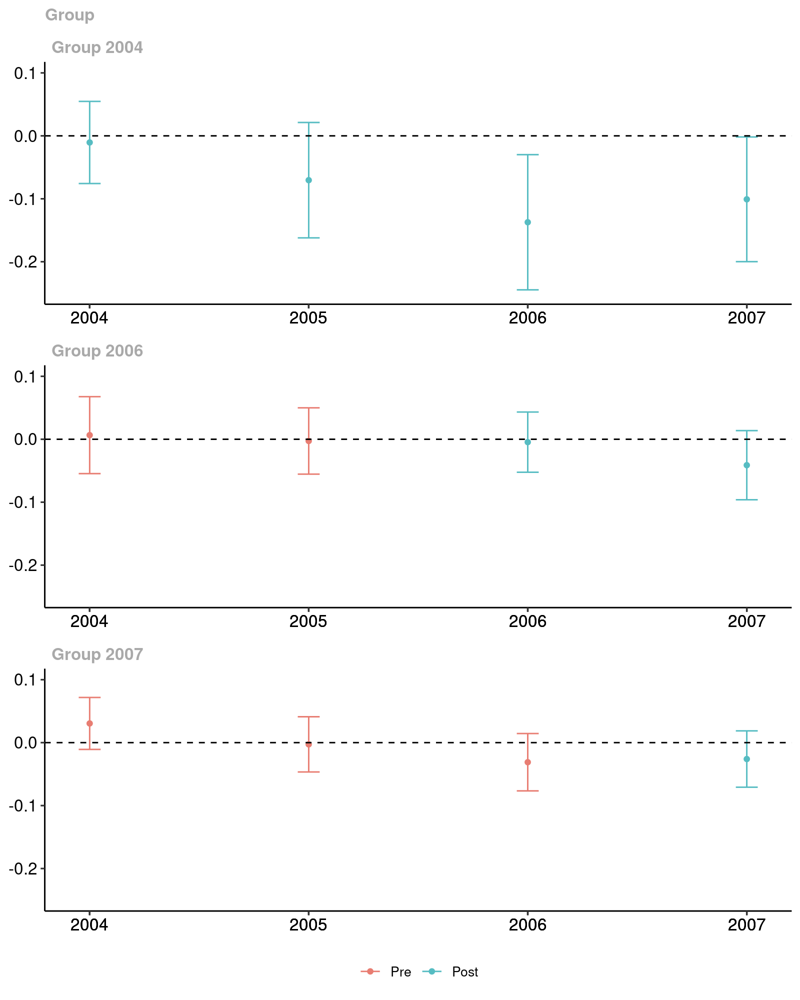
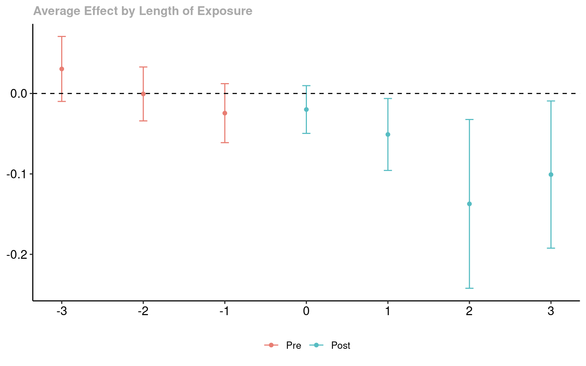

<!-- README.md is generated from README.Rmd. Please edit that file -->

# Difference-in-Differences 

[](https://cran.r-project.org/package=did)
[](https://cran.r-project.org/package=did)
[](https://cran.r-project.org/package=did)
[](https://github.com/bcallaway11/did)
[](https://cran.r-project.org/web/checks/check_results_did.html)
[](https://github.com/bcallaway11/did/commits/master)

<!-- README.md is generated from README.Rmd. Please edit that file -->

The **did** package contains tools for computing average treatment
effect parameters in a Difference-in-Differences setup allowing for

  - More than two time periods

  - Variation in treatment timing (i.e., units can become treated at
    different points in time)

  - Treatment effect heterogeneity (i.e, the effect of participating in
    the treatment can vary across units and exhibit potentially complex
    dynamics, selection into treatment, or time effects)

  - The parallel trends assumption holds only after conditioning on
    covariates

The main parameters are **group-time average treatment effects**. These
are the average treatment effect for a particular group (group is
defined by treatment timing) in a particular time period. These
parameters are a natural generalization of the average treatment effect
on the treated (ATT) which is identified in the textbook case with two
periods and two groups to the case with multiple periods.

Group-time average treatment effects are also natural building blocks
for more aggregated treatment effect parameters such as overall
treatment effects or event-study-type estimands.

## Getting Started

There has been some recent work on DiD with multiple time periods. The
**did** package implements the framework put forward in

  - [Callaway, Brantly and Pedro H.C. Sant’Anna.
    "Difference-in-Differences with Multiple Time Periods." Journal of
    Econometrics, Vol. 225, No. 2,
    pp. 200-230, 2021.](https://doi.org/10.1016/j.jeconom.2020.12.001)
    or [arXiv](https://arxiv.org/abs/1803.09015)

**Higher level discussions of issues are available in**

  - [Our approach to DiD with multiple time
    periods](https://bcallaway11.github.io/did/articles/multi-period-did.html)

## Installation

You can install **did** from CRAN with:

``` r
install.packages("did")
```

or get the latest version from github with:

``` r
# install.packages("devtools")
devtools::install_github("bcallaway11/did")
```

## A short example

The following is a simplified example of the effect of states increasing
their minimum wages on county-level teen employment rates which comes
from [Callaway and Sant’Anna
(2021)](https://authors.elsevier.com/a/1cFzc15Dji4pnC).

  - [More detailed examples are also
    available](https://bcallaway11.github.io/did/articles/did-basics.html)

A subset of the data is available in the package and can be loaded by

``` r
  library(did)
  data(mpdta)
```

The dataset contains 500 observations of county-level teen employment
rates from 2003-2007. Some states are first treated in 2004, some in
2006, and some in 2007 (see the paper for more details). The important
variables in the dataset are

  - **lemp** This is the log of county-level teen employment. It is the
    outcome variable

  - **first.treat** This is the period when a state first increases its
    minimum wage. It can be 2004, 2006, or 2007. It is the variable that
    defines *group* in this application

  - **year** This is the year and is the *time* variable

  - **countyreal** This is an id number for each county and provides the
    individual identifier in this panel data context

To estimate group-time average treatment effects, use the **att\_gt**
function

``` r
out <- att_gt(yname = "lemp",
              gname = "first.treat",
              idname = "countyreal",
              tname = "year",
              xformla = ~1,
              data = mpdta,
              est_method = "reg"
              )
```

**att\_gt** returns a class **MP** object. This has a lot of
information, but most importantly is has estimates of the group-time
average treatment effects and their standard errors. To see these, we
can call the **summary** function

``` r
summary(out)
#> 
#> Call:
#> att_gt(yname = "lemp", tname = "year", idname = "countyreal", 
#>     gname = "first.treat", xformla = ~1, data = mpdta, est_method = "reg")
#> 
#> Reference: Callaway, Brantly and Pedro H.C. Sant'Anna.  "Difference-in-Differences with Multiple Time Periods." Journal of Econometrics, Vol. 225, No. 2, pp. 200-230, 2021. <https://doi.org/10.1016/j.jeconom.2020.12.001>, <https://arxiv.org/abs/1803.09015> 
#> 
#> Group-Time Average Treatment Effects:
#>  Group Time ATT(g,t) Std. Error [95% Simult.  Conf. Band]  
#>   2004 2004  -0.0105     0.0235       -0.0747      0.0537  
#>   2004 2005  -0.0704     0.0328       -0.1600      0.0192  
#>   2004 2006  -0.1373     0.0378       -0.2403     -0.0342 *
#>   2004 2007  -0.1008     0.0331       -0.1912     -0.0104 *
#>   2006 2004   0.0065     0.0236       -0.0578      0.0708  
#>   2006 2005  -0.0028     0.0205       -0.0587      0.0532  
#>   2006 2006  -0.0046     0.0192       -0.0570      0.0478  
#>   2006 2007  -0.0412     0.0200       -0.0959      0.0134  
#>   2007 2004   0.0305     0.0162       -0.0138      0.0748  
#>   2007 2005  -0.0027     0.0174       -0.0501      0.0446  
#>   2007 2006  -0.0311     0.0194       -0.0840      0.0219  
#>   2007 2007  -0.0261     0.0178       -0.0746      0.0225  
#> ---
#> Signif. codes: `*' confidence band does not cover 0
#> 
#> P-value for pre-test of parallel trends assumption:  0.16812
#> Control Group:  Never Treated,  Anticipation Periods:  0
#> Estimation Method:  Outcome Regression
```

This provides estimates of group-time average treatment effects for all
groups in all time periods. Group-time average treatment effects are
identified when `t >= g` (these are post-treatment time periods for each
group), but **summary** reports them even in periods when `t < g` –
these can be used to pre-test for the parallel trends assumption. The
`P-value for pre-test of parallel trends assumption` is for a Wald
pre-test of the parallel trends assumption. Here the parallel trends
assumption would not be rejected at conventional significance levels.

It is often also convenient to plot the group-time average treatment
effects. This can be done using the **ggdid** command:

``` r
ggdid(out, ylim = c(-.25,.1))
```



The red dots in the plot are pre-treatment group-time average treatment
effects . Here they are provided with 95% simultaneous confidence
intervals. These are the estimates that can be interpreted as a pre-test
of the parallel trends assumption. The blue dots are post-treatment
group-time average treatment effects. Under the parallel trends
assumption, these can be interpreted as policy effects – here the effect
of the minimum wage on county-level teen employment due to increasing
the minimum wage.

**Event Studies**

Although in the current example it is pretty easy to directly interpret
the group-time average treatment effects, there are many cases where it
is convenient to aggregate the group-time average treatment effects into
a small number of parameters. A main type of aggregation is into an
*event study* plot.

To make an event study plot in the **did** package, one can use the
**aggte** function

``` r
es <- aggte(out, type = "dynamic")
```

Just like for group-time average treatment effects, these can be
summarized and plotted. First, the summary

``` r
summary(es)
#> 
#> Call:
#> aggte(MP = out, type = "dynamic")
#> 
#> Reference: Callaway, Brantly and Pedro H.C. Sant'Anna.  "Difference-in-Differences with Multiple Time Periods." Journal of Econometrics, Vol. 225, No. 2, pp. 200-230, 2021. <https://doi.org/10.1016/j.jeconom.2020.12.001>, <https://arxiv.org/abs/1803.09015> 
#> 
#> 
#> Overall summary of ATT's based on event-study/dynamic aggregation:  
#>      ATT    Std. Error     [ 95%  Conf. Int.]  
#>  -0.0772        0.0216    -0.1196     -0.0348 *
#> 
#> 
#> Dynamic Effects:
#>  Event time Estimate Std. Error [95% Simult.  Conf. Band]  
#>          -3   0.0305     0.0153       -0.0101      0.0712  
#>          -2  -0.0006     0.0134       -0.0361      0.0350  
#>          -1  -0.0245     0.0155       -0.0656      0.0166  
#>           0  -0.0199     0.0126       -0.0533      0.0135  
#>           1  -0.0510     0.0163       -0.0941     -0.0078 *
#>           2  -0.1373     0.0387       -0.2398     -0.0347 *
#>           3  -0.1008     0.0376       -0.2006     -0.0011 *
#> ---
#> Signif. codes: `*' confidence band does not cover 0
#> 
#> Control Group:  Never Treated,  Anticipation Periods:  0
#> Estimation Method:  Outcome Regression
```

The column `event time` is for each group relative to when they first
participate in the treatment. To give some examples, `event time=0`
corresponds to the *on impact* effect, and `event time=-1` is the
*effect* in the period before a unit becomes treated (checking that this
is equal to 0 is potentially useful as a pre-test).

To plot the event study, use **ggdid**

``` r
ggdid(es)
```



The figure here is very similar to the group-time average treatment
effects. Red dots are pre-treatment periods, blue dots are
post-treatment periods. The difference is that the x-axis is in event
time.

**Overall Effect of Participating in the Treatment**

The event study above reported an overall effect of participating in the
treatment. This was computed by averaging the average effects computed
at each length of exposure.

In many cases, a more general purpose overall treatment effect parameter
is give by computing the average treatment effect for each group, and
then averaging across groups. This sort of procedure provides an average
treatment effect parameter with a very similar interpretation to the
Average Treatment Effect on the Treated (ATT) in the two period and two
group case.

To compute this overall average treatment effect parameter, use

``` r
group_effects <- aggte(out, type = "group")
summary(group_effects)
#> 
#> Call:
#> aggte(MP = out, type = "group")
#> 
#> Reference: Callaway, Brantly and Pedro H.C. Sant'Anna.  "Difference-in-Differences with Multiple Time Periods." Journal of Econometrics, Vol. 225, No. 2, pp. 200-230, 2021. <https://doi.org/10.1016/j.jeconom.2020.12.001>, <https://arxiv.org/abs/1803.09015> 
#> 
#> 
#> Overall summary of ATT's based on group/cohort aggregation:  
#>     ATT    Std. Error     [ 95%  Conf. Int.]  
#>  -0.031        0.0125    -0.0554     -0.0066 *
#> 
#> 
#> Group Effects:
#>  Group Estimate Std. Error [95% Simult.  Conf. Band]  
#>   2004  -0.0797     0.0283       -0.1427     -0.0168 *
#>   2006  -0.0229     0.0168       -0.0603      0.0145  
#>   2007  -0.0261     0.0176       -0.0651      0.0130  
#> ---
#> Signif. codes: `*' confidence band does not cover 0
#> 
#> Control Group:  Never Treated,  Anticipation Periods:  0
#> Estimation Method:  Outcome Regression
```

Of particular interest is the `Overall ATT` in the results. Here, we
estimate that increasing the minimum wage decreased teen employment by
3.1% and the effect is marginally statistically significant.

## Additional Resources

We have provided several more vignettes that may be helpful for using
the **did** package

  - [Getting Started with the did
    Package](https://bcallaway11.github.io/did/articles/did-basics.html)

  - [Introduction to DiD with Multiple Time
    Periods](https://bcallaway11.github.io/did/articles/multi-period-did.html)

  - [Pre-Testing in a DiD Setup using the did
    Package](https://bcallaway11.github.io/did/articles/pre-testing.html)

  - [Writing Extensions to the did
    Package](https://bcallaway11.github.io/did/articles/extensions.html)
