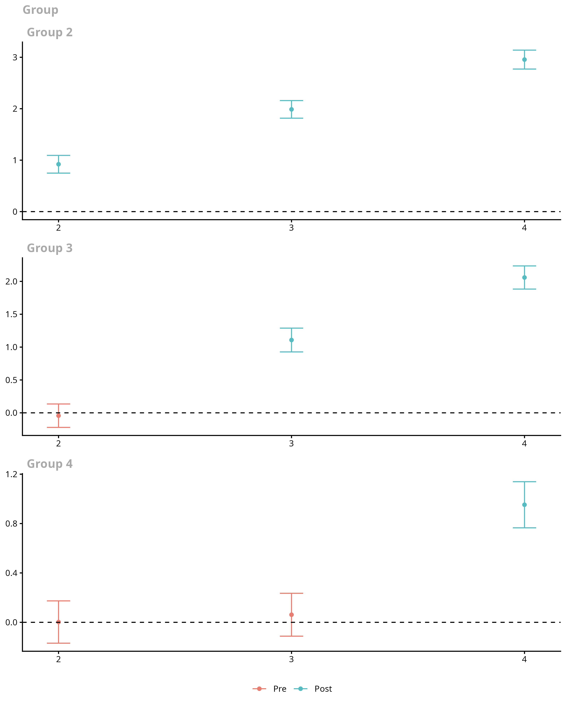
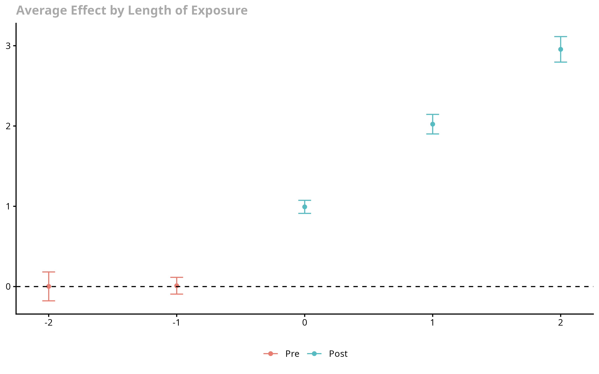
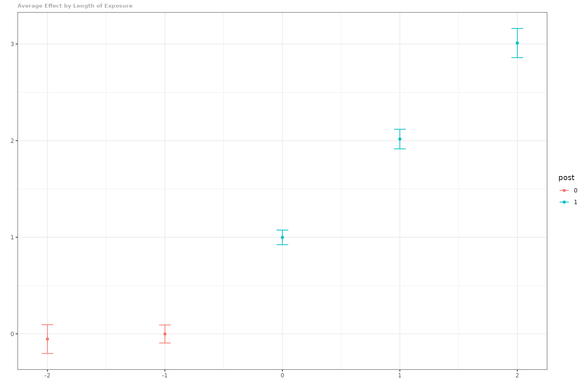
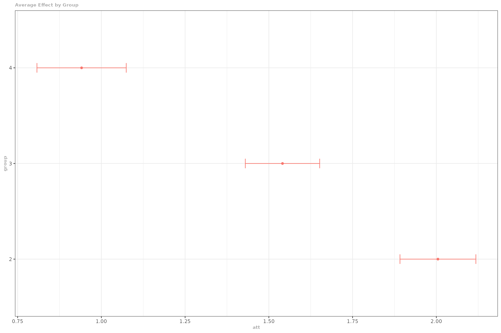
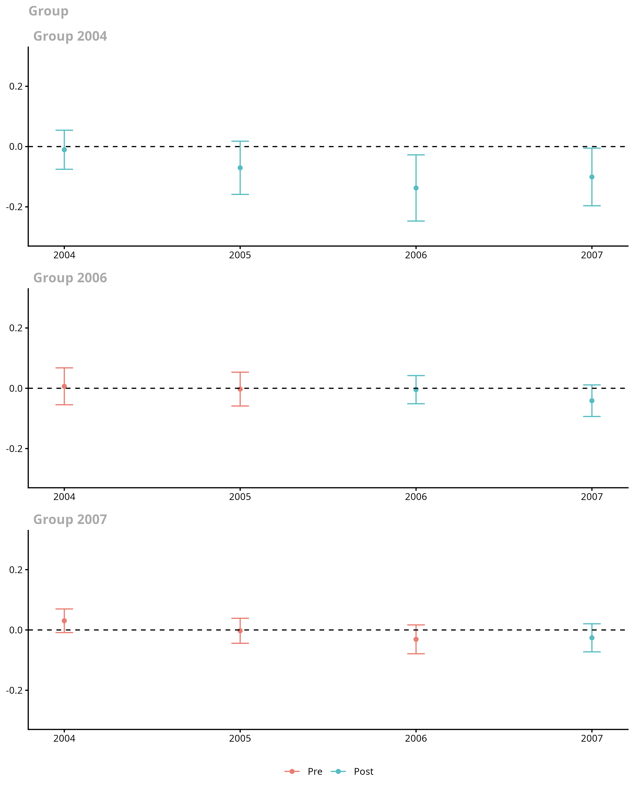
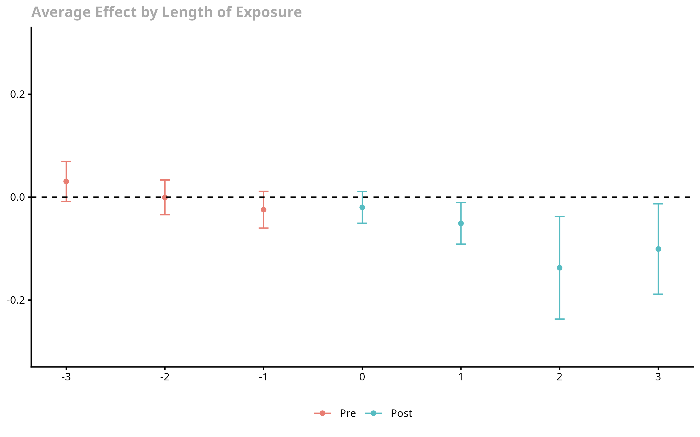
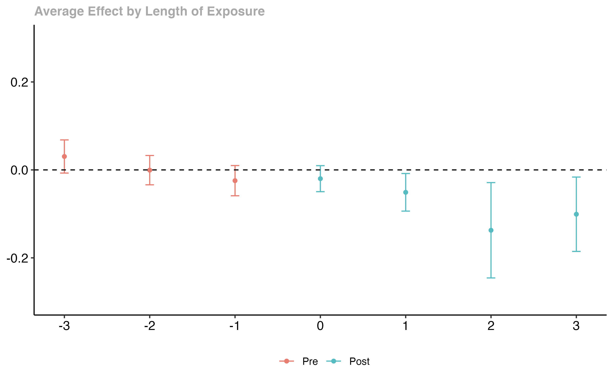

# Getting Started with the did Package

## Introduction

This vignette discusses the basics of using Difference-in-Differences
(DiD) designs to identify and estimate the average effect of
participating in a treatment with a particular focus on tools from the
**did** package. The background article for it is [Callaway and
Sant’Anna (2021), “Difference-in-Differences with Multiple Time
Periods”](https://doi.org/10.1016/j.jeconom.2020.12.001).

- The **did** package allows for multiple periods and variation in
  treatment timing

- The **did** package allows the parallel trends assumption to hold
  conditional on covariates

- Treatment effect estimates coming from the **did** package do not
  suffer from any of the drawbacks associated with two-way fixed effects
  regressions or event study regressions when there are multiple periods
  / variation in treatment timing

- The **did** package can deliver disaggregated *group-time average
  treatment effects* as well as event-study type estimates (treatment
  effects parameters corresponding to different lengths of exposure to
  the treatment) and overall treatment effect estimates.

We use some notation in this vignette that is fully explained in our
[Introduction to DiD with Multiple Time
Periods](https://bcallaway11.github.io/did/articles/multi-period-did.md)
vignette.

## Examples with simulated data

Let’s start with a really simple example with simulated data. Here,
there are going to be 4 time periods. There are 4000 units in the
treated group that are randomly (with equal probability) assigned to
first participate in the treatment (a *group*) in each time period. And
there are 4000 \`\`never treated’’ units. The data generating process
for untreated potential outcomes

$$Y_{it}(0) = \theta_{t} + \eta_{i} + X_{i}\prime\beta_{t} + v_{it}$$

This is an example of a very simple model for untreated potential
outcomes that is compatible with a conditional parallel trends
assumption. In particular,

- We consider the case where $\eta_{i}$ can be distributed differently
  across groups. This means that comparisons of outcomes in levels
  between treated and untreated units will not deliver an average
  treatment effect parameter.

- Next, notice that
  $$\Delta Y_{it}(0) = \left( \theta_{t} - \theta_{t - 1} \right) + X_{i}\prime\left( \beta_{t} - \beta_{t - 1} \right) + \Delta v_{it}$$

  so that the path of outcomes depends on covariates. And, in general,
  unconditional parallel trends is not valid in this setup unless
  either (i) the mean of the covariates is the same across groups (e.g.,
  when treatment groups are independent of covariates), or (ii)
  $\beta_{t} = \beta_{t - 1} = \cdots = \beta_{1}$ (this is the case
  when the path of untreated potential outcomes doesn’t actually depend
  on covariates).

- In order to think about treatment effects, we also use the following
  stylized model for treated potential outcomes
  $$Y_{it}(g) = Y_{it}(0) + \mathbf{1}\{ t \geq g\}(e + 1) + \left( u_{it} - v_{it} \right)$$

  where $e:=t - g$ is the event time (i.e., the difference between the
  current time period and the time when a unit becomes treated), and the
  last term just allows for the error terms to be different for treated
  and untreated potential outcomes. It immediately follows that, in this
  particular example, $$ATT(g,t) = e + 1$$ for all post-treatment
  periods $t \geq g$.

  In other words, the average effect of participating in the treatment
  for units in group $g$ is equal to their length of exposure plus one.
  Note that, for simplicity, we are considering the case where treatment
  effects are homogeneous across groups. Also, in this setup, units do
  not anticipate their treatment status, so the *no-anticipation
  assumption* is also satisfied.

- For the simulations, we also set

  - $\theta_{t} = \beta_{t} = t$ for $t = 1,\ldots,4$
    - $\eta_{i} \sim N\left( G_{i},1 \right)$ where $G_{i}$ is which
      group an individual belongs to,
    - $X_{i} \sim N\left( \mu_{D_{i}},1 \right)$ where $\mu_{D_{i}} = 1$
      for never treated units and 0 otherwise,
    - $v_{it} \sim N(0,1)$, and $u_{it} \sim N(0,1)$.  
    - Also, all random variables are drawn independently of each other.

### Estimating Group-Time Average Treatment Effects

**Building the dataset**

``` r
# set seed so everything is reproducible
set.seed(1814)

# generate dataset with 4 time periods
sp <- reset.sim()
sp$te <- 0
time.periods <- 4

# add dynamic effects
sp$te.e <- 1:time.periods

# generate data set with these parameters
# here, we dropped all units who are treated in time period 1 as they do not help us recover ATT(g,t)'s.
dta <- build_sim_dataset(sp)

# How many observations remained after dropping the ``always-treated'' units
nrow(dta)
#> [1] 15916
#This is what the data looks like
head(dta)
#> # A tibble: 6 × 7
#>       G      X    id cluster period     Y treat
#>   <dbl>  <dbl> <int>   <int>  <dbl> <dbl> <dbl>
#> 1     3 -0.876     1       5      1  5.56     1
#> 2     3 -0.876     1       5      2  4.35     1
#> 3     3 -0.876     1       5      3  7.13     1
#> 4     3 -0.876     1       5      4  6.24     1
#> 5     2 -0.874     2      36      1 -3.66     1
#> 6     2 -0.874     2      36      2 -1.27     1
```

**Estimating Group-Time Average Treatment Effects**

The main function to estimate group-time average treatment effects is
the `att_gt` function. [See documentation
here](https://bcallaway11.github.io/did/reference/att_gt.md). The most
basic call to `att_gt` is given in the following

``` r
# estimate group-time average treatment effects using att_gt method
example_attgt <- att_gt(yname = "Y",
                        tname = "period",
                        idname = "id",
                        gname = "G",
                        xformla = ~X,
                        data = dta
                        )

# summarize the results
summary(example_attgt)
#> 
#> Call:
#> att_gt(yname = "Y", tname = "period", idname = "id", gname = "G", 
#>     xformla = ~X, data = dta)
#> 
#> Reference: Callaway, Brantly and Pedro H.C. Sant'Anna.  "Difference-in-Differences with Multiple Time Periods." Journal of Econometrics, Vol. 225, No. 2, pp. 200-230, 2021. <https://doi.org/10.1016/j.jeconom.2020.12.001>, <https://arxiv.org/abs/1803.09015> 
#> 
#> Group-Time Average Treatment Effects:
#>  Group Time ATT(g,t) Std. Error [95% Simult.  Conf. Band]  
#>      2    2   0.9209     0.0638        0.7486      1.0932 *
#>      2    3   1.9875     0.0633        1.8164      2.1586 *
#>      2    4   2.9552     0.0680        2.7715      3.1389 *
#>      3    2  -0.0433     0.0660       -0.2215      0.1349  
#>      3    3   1.1080     0.0670        0.9271      1.2890 *
#>      3    4   2.0590     0.0652        1.8828      2.2352 *
#>      4    2   0.0023     0.0634       -0.1690      0.1736  
#>      4    3   0.0615     0.0643       -0.1122      0.2353  
#>      4    4   0.9523     0.0691        0.7656      1.1391 *
#> ---
#> Signif. codes: `*' confidence band does not cover 0
#> 
#> P-value for pre-test of parallel trends assumption:  0.60857
#> Control Group:  Never Treated,  Anticipation Periods:  0
#> Estimation Method:  Doubly Robust
```

The summary of `example_attgt` provides estimates of the group-time
average treatment effects in the column labeled `att`, and the
corresponding bootstrapped-based standard errors are given in the column
`se`. The corresponding groups and times are given in the columns
`group` and `time`. Under the no-anticipation and parallel trends
assumptions, group-time average treatment effects are identified in
periods when $t \geq g$ (i.e., post-treatment periods for each group).
The table also reports pseudo group-time average treatment effects when
$t < g$ (i.e., pre-treatment periods for group $g$). These can be used
as a pre-test for the parallel trends assumption (as long as we assume
that the no-anticipation assumption indeed holds). In addition, the
results of a Wald pre-test of the parallel trends assumption is reported
in the summary of the results. [A much more detailed discussion of using
the **did** package for pre-testing is available
here](https://bcallaway11.github.io/did/articles/pre-testing.md).

Next, we’ll demonstrate how to plot group-time average treatment
effects. To plot these, use the `ggdid` function which builds off the
`ggplot2` package.

``` r
# plot the results
ggdid(example_attgt)
```



The resulting figure is one that contains separate plots for each group.
Notice in the figure above, the first plot is labeled “Group 2”, the
second “Group 3”, etc. Then, the figure contains estimates of group-time
average treatment effects for each group in each time period along with
a simultaneous confidence interval. The red dots in the plots are
pre-treatment pseudo group-time average treatment effects and are most
useful for pre-testing the parallel trends assumption. The blue dots are
post-treatment group-time average treatment effects and should be
interpreted as the average effect of participating in the treatment for
units in a particular group at a particular point in time.

### Other features of the `did` package

The above discussion covered only the most basic case for using the
`did` package. There are a number of simple extensions that are useful
in applications.

#### Adjustments for Multiple Hypothesis Testing

By default, the `did` package reports simultaneous confidence bands in
plots of group-time average treatment effects with multiple time periods
– these are confidence bands that are robust to multiple hypothesis
testing \[essentially, the idea here is to use the same standard errors
but make an adjustment to the critical value to account for multiple
testing – in the example in this section, the critical value for a 95%
uniform confidence band is 2.7 instead of 1.96\]. You can turn this off
and compute analytical standard errors and corresponding figures with
*pointwise* confidence intervals by setting `bstrap=FALSE, cband=FALSE`
in the call to `att_gt`…**but we don’t recommend it**!

#### Aggregating group-time average treatment effects

In many applications, there can be a large number of groups and time
periods. In this case, it may be infeasible to interpret plots of
group-time average treatment effects. The `did` package provides a
number of ways to aggregate group-time average treatment effects using
the `aggte` function.

##### Simple Aggregation

One idea that is likely to immediately come to mind is to just return a
weighted average of all group-time average treatment effects with
weights proportional to the group size. This is available by calling the
`aggte` function with `type = simple`.

``` r
agg.simple <- aggte(example_attgt, type = "simple")
summary(agg.simple)
#> 
#> Call:
#> aggte(MP = example_attgt, type = "simple")
#> 
#> Reference: Callaway, Brantly and Pedro H.C. Sant'Anna.  "Difference-in-Differences with Multiple Time Periods." Journal of Econometrics, Vol. 225, No. 2, pp. 200-230, 2021. <https://doi.org/10.1016/j.jeconom.2020.12.001>, <https://arxiv.org/abs/1803.09015> 
#> 
#> 
#>     ATT    Std. Error     [ 95%  Conf. Int.]  
#>  1.6583        0.0333     1.5931      1.7236 *
#> 
#> 
#> ---
#> Signif. codes: `*' confidence band does not cover 0
#> 
#> Control Group:  Never Treated,  Anticipation Periods:  0
#> Estimation Method:  Doubly Robust
```

This sort of aggregation immediately avoids the negative weights issue
that two-way fixed effects regressions can suffer from, but we often
think that *there are better alternatives*. In particular, this `simple`
aggregation tends to overweight the effect of early-treated groups
simply because we observe more of them during post-treatment periods. We
think there are likely to be better alternatives in most applications.

##### Dynamic Effects and Event Studies

One of the most common alternative approaches is to aggregate group-time
effects into an event study plot. Group-time average treatment effects
can immediately be averaged into average treatment effects at different
lengths of exposure to the treatment using the following code:

``` r
agg.es <- aggte(example_attgt, type = "dynamic")
summary(agg.es)
#> 
#> Call:
#> aggte(MP = example_attgt, type = "dynamic")
#> 
#> Reference: Callaway, Brantly and Pedro H.C. Sant'Anna.  "Difference-in-Differences with Multiple Time Periods." Journal of Econometrics, Vol. 225, No. 2, pp. 200-230, 2021. <https://doi.org/10.1016/j.jeconom.2020.12.001>, <https://arxiv.org/abs/1803.09015> 
#> 
#> 
#> Overall summary of ATT's based on event-study/dynamic aggregation:  
#>     ATT    Std. Error     [ 95%  Conf. Int.]  
#>  1.9904        0.0375     1.9169      2.0639 *
#> 
#> 
#> Dynamic Effects:
#>  Event time Estimate Std. Error [95% Simult.  Conf. Band]  
#>          -2   0.0023     0.0705       -0.1777      0.1824  
#>          -1   0.0105     0.0409       -0.0939      0.1149  
#>           0   0.9929     0.0319        0.9115      1.0742 *
#>           1   2.0231     0.0477        1.9013      2.1450 *
#>           2   2.9552     0.0622        2.7964      3.1141 *
#> ---
#> Signif. codes: `*' confidence band does not cover 0
#> 
#> Control Group:  Never Treated,  Anticipation Periods:  0
#> Estimation Method:  Doubly Robust
ggdid(agg.es)
```



In this figure, the x-axis is the length of exposure to the treatment.
Length of exposure equal to 0 provides the average effect of
participating in the treatment across groups in the time period when
they first participate in the treatment (instantaneous treatment
effect). Length of exposure equal to -1 corresponds to the time period
before groups first participate in the treatment, and length of exposure
equal to 1 corresponds to the first time period after initial exposure
to the treatment.

As we would expect based on the data that we generated, it looks like
parallel trends holds in pre-treatment periods and the effect of
participating in the treatment is increasing with length of exposure of
the treatment.

The Overall ATT here averages the average treatment effects across all
lengths of exposure to the treatment.

##### Group-Specific Effects

Another idea is to look at average effects specific to each group. It is
also straightforward to aggregate group-time average treatment effects
into group-specific average treatment effects using the following code:

``` r
agg.gs <- aggte(example_attgt, type = "group")
summary(agg.gs)
#> 
#> Call:
#> aggte(MP = example_attgt, type = "group")
#> 
#> Reference: Callaway, Brantly and Pedro H.C. Sant'Anna.  "Difference-in-Differences with Multiple Time Periods." Journal of Econometrics, Vol. 225, No. 2, pp. 200-230, 2021. <https://doi.org/10.1016/j.jeconom.2020.12.001>, <https://arxiv.org/abs/1803.09015> 
#> 
#> 
#> Overall summary of ATT's based on group/cohort aggregation:  
#>    ATT    Std. Error     [ 95%  Conf. Int.]  
#>  1.488        0.0343     1.4208      1.5553 *
#> 
#> 
#> Group Effects:
#>  Group Estimate Std. Error [95% Simult.  Conf. Band]  
#>      2   1.9545     0.0520        1.8298      2.0793 *
#>      3   1.5835     0.0562        1.4488      1.7183 *
#>      4   0.9523     0.0649        0.7968      1.1078 *
#> ---
#> Signif. codes: `*' confidence band does not cover 0
#> 
#> Control Group:  Never Treated,  Anticipation Periods:  0
#> Estimation Method:  Doubly Robust
ggdid(agg.gs)
```



In this figure, the y-axis is categorized by group. The x-axis provides
estimates of the average effect of participating in the treatment for
units in each group averaged across all time periods after that group
becomes treated. In our example, the average effect of participating in
the treatment is largest for group 2 – this is because the effect of
treatment here increases with length of exposure to the treatment, and
they are the group that is exposed to the treatment for the longest.

The Overall ATT averages the group-specific treatment effects across
groups. In our view, *this parameter is a leading choice as an overall
summary effect of participating in the treatment*. It is the average
effect of participating in the treatment that was experienced across all
units that participate in the treatment in any period. In this sense, it
has a similar interpretation to the ATT in the textbook case where there
are exactly two periods and two groups.

##### Calendar Time Effects

Finally, the `did` package allows aggregations across different time
periods. To do this

``` r
agg.ct <- aggte(example_attgt, type = "calendar")
summary(agg.ct)
#> 
#> Call:
#> aggte(MP = example_attgt, type = "calendar")
#> 
#> Reference: Callaway, Brantly and Pedro H.C. Sant'Anna.  "Difference-in-Differences with Multiple Time Periods." Journal of Econometrics, Vol. 225, No. 2, pp. 200-230, 2021. <https://doi.org/10.1016/j.jeconom.2020.12.001>, <https://arxiv.org/abs/1803.09015> 
#> 
#> 
#> Overall summary of ATT's based on calendar time aggregation:  
#>     ATT    Std. Error     [ 95%  Conf. Int.]  
#>  1.4808        0.0347     1.4128      1.5488 *
#> 
#> 
#> Time Effects:
#>  Time Estimate Std. Error [95% Simult.  Conf. Band]  
#>     2   0.9209     0.0632        0.7722      1.0697 *
#>     3   1.5491     0.0496        1.4324      1.6659 *
#>     4   1.9724     0.0500        1.8547      2.0901 *
#> ---
#> Signif. codes: `*' confidence band does not cover 0
#> 
#> Control Group:  Never Treated,  Anticipation Periods:  0
#> Estimation Method:  Doubly Robust
ggdid(agg.ct)
```



In this figure, the x-axis is the time period and the estimates along
the y-axis are the average effect of participating in the treatment in a
particular time period for all groups that participated in the treatment
in that time period.

#### Small Group Sizes

Small group sizes can sometimes cause estimation problems in the `did`
package. If a group-time average treatment effect cannot be estimated
(e.g., because a group has too few observations relative to the number
of covariates in the model, the covariate matrix for some comparison is
singular, or there are overlap violations), `att_gt` issues a warning
for the affected $(g,t)$ cell and reports `NA` for that $ATT(g,t)$
rather than erroring. (The exception is when the never-treated
comparison group itself is too small, in which case `att_gt` stops and
suggests setting `control_group = "notyettreated"`.) The `did` package
also reports a warning if any group has fewer observations than the
number of covariates in the model plus five.

In addition, statistical inference, particularly on group-time average
treatment may become more tenuous with small groups. For example, the
effective sample size for estimating the change in outcomes over time
for individuals in a particular group is equal to the number of
observations in that group and asymptotic results are unlikely to
provide good approximations to the sampling distribution of group-time
average treatment effects when the number of units in a group is small.
In these cases, one should be very cautious about interpreting the
$ATT(g,t)$ results for these small groups.

A reasonable alternative approach in this case is to just focus on
aggregated treatment effect parameters (i.e., to run
`aggte(..., type = "group")` or `aggte(...,type = "dynamic")`). For each
of these cases, the effective sample size is the total number of units
that are ever treated. As long as the total number of ever treated units
is “large” (which should be the case for many DiD application), then the
statistical inference results provided by the `did` package should be
more stable.

#### Selecting Alternative Control Groups

By default, the `did` package uses the group of units that never
participate in the treatment as the control group. In this case, if
there is no group that never participates, then the `did` package will
drop the last period and set units that do not become treated until the
last period as the control group (this will also throw a warning). The
other option for the control group is to use the “not yet treated”. The
“not yet treated” include the never treated as well as those units that,
for a particular point in time, have not been treated yet (though they
eventually become treated). This group is at least as large as the never
treated group though it changes across time periods. To use the “not yet
treated” as the control, set the option `control_group="notyettreated"`.

``` r
example_attgt_altcontrol <- att_gt(yname = "Y",
                                   tname = "period",
                                   idname = "id",
                                   gname = "G",
                                   xformla = ~X,
                                   data = dta,
                                   control_group = "notyettreated"          
                                   )
summary(example_attgt_altcontrol)
```

#### Repeated cross sections

The `did` package can also work with repeated cross section rather than
panel data. If the data is repeated cross sections, simply set the
option `panel = FALSE`. In this case, `idname` may be omitted. If
`idname` is supplied, it is still validated – it must be numeric, the
treatment timing variable (`gname`) must not vary within unit, and each
unit can appear at most once per time period – so for genuine repeated
cross sections (where, for example, the same household or region code
may appear multiple times in the same period) it is best to omit
`idname`. Aside from this, usage is nearly identical to the case with
panel data, although a few panel-only options (e.g.,
`fix_weights = "base_period"` or `fix_weights = "first_period"`) are not
available when `panel = FALSE`.

#### Unbalanced Panel Data

By default, the `did` package takes in panel data and, if it is not
balanced, coerces it into being a balanced panel by dropping units with
observations that are missing in any time period. However, if the user
specifies the option `allow_unbalanced_panel = TRUE`, then the `did`
package will not coerce the data into being balanced. Practically, the
main cost here is that the computation time will increase in this case.
We also recommend that users think carefully about why they have an
unbalanced panel before proceeding this direction.

#### Alternative Estimation Methods

The `did` package implements all the $2 \times 2$ DiD estimators that
are in the `DRDID` package. By default, the `did` package uses “doubly
robust” estimators that are based on first step linear regressions for
the outcome variable and logit for the generalized propensity score. The
other options are “ipw” for inverse probability weighting and “reg” for
regression.

``` r
example_attgt_reg <- att_gt(yname = "Y",
                            tname = "period",
                            idname = "id",
                            gname = "G",
                            xformla = ~X,
                            data = dta,
                            est_method = "reg"
                            )
summary(example_attgt_reg)
```

The argument `est_method` is also available to pass in a custom function
for estimating DiD with 2 periods and 2 groups. [See its documentation
for more
details](https://bcallaway11.github.io/did/reference/att_gt.md). **Fair
Warning:** this is very advanced use of the `did` package and should be
done with caution.

## An example with real data

Next, we use a subset of data that comes from [Callaway and Sant’Anna
(2020)](https://doi.org/10.1016/j.jeconom.2020.12.001). This is a
dataset that contains county-level teen employment rates from 2003-2007.
The data can be loaded by

``` r
data(mpdta)
```

`mpdta` is a balanced panel with 2500 observations. And the dataset
looks like

``` r
head(mpdta)
#>     year countyreal     lpop     lemp first.treat treat
#> 866 2003       8001 5.896761 8.461469        2007     1
#> 841 2004       8001 5.896761 8.336870        2007     1
#> 842 2005       8001 5.896761 8.340217        2007     1
#> 819 2006       8001 5.896761 8.378161        2007     1
#> 827 2007       8001 5.896761 8.487352        2007     1
#> 937 2003       8019 2.232377 4.997212        2007     1
```

**Data Requirements**

In particular applications, the dataset should look like this with the
key parts being:

- The dataset should be in *long* format – each row corresponds to a
  particular unit at a particular point in time. Sometimes panel data is
  in *wide* format – each row contains all the information about a
  particular unit in all time periods. To convert from wide to long in
  `R`, one can use the
  [`tidyr::pivot_longer`](https://tidyr.tidyverse.org/reference/pivot_longer.html)
  function. [Here is an
  example](http://www.cookbook-r.com/Manipulating_data/Converting_data_between_wide_and_long_format/)

- There needs to be an id variable. In `mpdta`, it is the variable
  `countyreal`. This should not vary over time for particular units. The
  name of this variable is passed to methods in the `did` package by
  setting, for example, `idname = "countyreal"`

- There needs to be a time variable. In `mpdta`, it is the variable
  `year`. The name of this variable is passed to methods in the `did`
  package by setting, for example, `tname = "year"`

- In this application, the outcome is `lemp`. The name of this variable
  is passed to methods in the `did` package by setting, for example,
  `yname = "lemp"`

- There needs to be a group variable. In `mpdta`, it is the variable
  `first.treat`. This is the time period when an individual first
  becomes treated. *For individuals that are never treated, this
  variable should be set equal to 0.* The name of this variable is
  passed to methods in the `did` package by setting, for example,
  `gname = "first.treat"`

- The `did` package allows for incorporating covariates so that the
  parallel trends assumption holds only after conditioning on these
  covariates. In `mpdta`, `lpop` is the log of county population.
  Covariates may be time-invariant or time-varying. With balanced panel
  data, the `did` package sets the value of a time-varying covariate to
  be equal to the value of the covariate in the “base period” where, in
  post-treatment periods the base period is the period immediately
  before observations in a particular group become treated (when there
  is anticipation, it is before anticipation effects start too), and in
  pre-treatment periods the base period is the period right before the
  current period. With repeated cross sections data or unbalanced panel
  data, the covariates are instead taken from each time period (see the
  discussion of `xformla` in the `att_gt` documentation for details).
  Covariates are passed as a formula to the `did` package by setting,
  for example, `xformla = ~lpop`; the formula may also include
  transformations of covariates (e.g., `~ I(lpop^2)`, `~ log(lpop)`,
  interactions) as well as factor variables. For estimators under
  unconditional parallel trends, the `xformla` argument can be left
  blank or can be set as `xformla = ~1` to only include a constant.

#### The Effect of the Minimum Wage on Youth Employment

Next, we walk through a straightforward, but realistic way to use the
`did` package to carry out an application.

**Side Comment:** This is just an example of how to use our method in a
real-world setup. To really evaluate the effect of the minimum wage on
teen employment, one would need to be more careful along a number of
dimensions. Thus, results displayed here should be interpreted as
illustrative only.

We’ll consider two cases. For the first case, we will not condition on
any covariates. For the second, we will condition on the log of county
population (in a “real” application, one might want to condition on more
covariates).

``` r
# estimate group-time average treatment effects without covariates
mw.attgt <- att_gt(yname = "lemp",
                   gname = "first.treat",
                   idname = "countyreal",
                   tname = "year",
                   xformla = ~1,
                   data = mpdta
                   )

# summarize the results
summary(mw.attgt)
#> 
#> Call:
#> att_gt(yname = "lemp", tname = "year", idname = "countyreal", 
#>     gname = "first.treat", xformla = ~1, data = mpdta)
#> 
#> Reference: Callaway, Brantly and Pedro H.C. Sant'Anna.  "Difference-in-Differences with Multiple Time Periods." Journal of Econometrics, Vol. 225, No. 2, pp. 200-230, 2021. <https://doi.org/10.1016/j.jeconom.2020.12.001>, <https://arxiv.org/abs/1803.09015> 
#> 
#> Group-Time Average Treatment Effects:
#>  Group Time ATT(g,t) Std. Error [95% Simult.  Conf. Band]  
#>   2004 2004  -0.0105     0.0243       -0.0753      0.0543  
#>   2004 2005  -0.0704     0.0331       -0.1586      0.0178  
#>   2004 2006  -0.1373     0.0412       -0.2470     -0.0275 *
#>   2004 2007  -0.1008     0.0358       -0.1963     -0.0054 *
#>   2006 2004   0.0065     0.0230       -0.0547      0.0677  
#>   2006 2005  -0.0028     0.0210       -0.0588      0.0533  
#>   2006 2006  -0.0046     0.0175       -0.0513      0.0421  
#>   2006 2007  -0.0412     0.0196       -0.0936      0.0111  
#>   2007 2004   0.0305     0.0147       -0.0087      0.0697  
#>   2007 2005  -0.0027     0.0156       -0.0442      0.0387  
#>   2007 2006  -0.0311     0.0179       -0.0789      0.0168  
#>   2007 2007  -0.0261     0.0175       -0.0726      0.0205  
#> ---
#> Signif. codes: `*' confidence band does not cover 0
#> 
#> P-value for pre-test of parallel trends assumption:  0.16812
#> Control Group:  Never Treated,  Anticipation Periods:  0
#> Estimation Method:  Doubly Robust

# plot the results
# set ylim so that all plots have the same scale along y-axis
ggdid(mw.attgt, ylim = c(-.3, .3))
```



There are a few things to notice in this case

- There does not appear to be much evidence against the parallel trends
  assumption. One fails to reject using the Wald test reported in
  `summary`; likewise the uniform confidence bands cover 0 in all
  pre-treatment periods.

- There is some evidence of negative effects of the minimum wage on
  employment. Two group-time average treatment effects are negative and
  statistically different from 0. These results also suggest that it may
  be helpful to aggregate the group-time average treatment effects.

``` r
# aggregate the group-time average treatment effects
mw.dyn <- aggte(mw.attgt, type = "dynamic")
summary(mw.dyn)
#> 
#> Call:
#> aggte(MP = mw.attgt, type = "dynamic")
#> 
#> Reference: Callaway, Brantly and Pedro H.C. Sant'Anna.  "Difference-in-Differences with Multiple Time Periods." Journal of Econometrics, Vol. 225, No. 2, pp. 200-230, 2021. <https://doi.org/10.1016/j.jeconom.2020.12.001>, <https://arxiv.org/abs/1803.09015> 
#> 
#> 
#> Overall summary of ATT's based on event-study/dynamic aggregation:  
#>      ATT    Std. Error     [ 95%  Conf. Int.]  
#>  -0.0772        0.0203    -0.1171     -0.0374 *
#> 
#> 
#> Dynamic Effects:
#>  Event time Estimate Std. Error [95% Simult.  Conf. Band]  
#>          -3   0.0305     0.0157       -0.0084      0.0694  
#>          -2  -0.0006     0.0136       -0.0343      0.0332  
#>          -1  -0.0245     0.0144       -0.0601      0.0112  
#>           0  -0.0199     0.0124       -0.0507      0.0108  
#>           1  -0.0510     0.0163       -0.0913     -0.0106 *
#>           2  -0.1373     0.0402       -0.2369     -0.0376 *
#>           3  -0.1008     0.0354       -0.1886     -0.0131 *
#> ---
#> Signif. codes: `*' confidence band does not cover 0
#> 
#> Control Group:  Never Treated,  Anticipation Periods:  0
#> Estimation Method:  Doubly Robust
ggdid(mw.dyn, ylim = c(-.3, .3))
```



These continue to be simultaneous confidence bands for dynamic effects.
The results are broadly similar to the ones from the group-time average
treatment effects: one fails to reject parallel trends in pre-treatment
periods and it looks like somewhat negative effects of the minimum wage
on youth employment.

One potential issue with these dynamic effect estimators is that the
composition of the groups changes with different lengths of exposure in
the event study plots. For example, for the group of states who
increased their minimum wage in 2007, we can only identify the
instantaneous average effect of the minimum wage ($e = 0$), whereas for
states that raised their minimum wage in 2004 (2006), we can identify
the average effect of the minimum wage on event-times $e = 0,1,2,3$
($e = 0,1$). When computing the event-study plot for $e = 0$, we would
aggregate the effects for all three groups, but this is not the case
when $e = 1,2,3$. If the effects of the minimum wage are systematically
different across groups (here, there is not much evidence of this as the
effect for all groups seems to be close to 0 on impact and perhaps
becoming more negative over time), then this can lead to confounding
dynamics and selective treatment timing among different groups.

One way to combat this is to balance the sample by (i) only including
groups that are exposed to the treatment for at least a certain number
of time periods and (ii) only look at dynamic effects in those time
periods. In the `did` package, one can do this by specifying the
`balance_e` option. Here, we set `balance_e = 1` – what this does is to
only consider groups of states that are treated in 2004 and 2006 (so we
can compute event-study-type parameters for them for $e = 0,1$), drops
the group treated in 2007 (as we can not compute the event-study-type
parameter with $e = 1$ for this group)), and then only looks at
instantaneous average effects and the average effect one period after
states raised the minimum wage.

``` r
mw.dyn.balance <- aggte(mw.attgt, type = "dynamic", balance_e = 1)
summary(mw.dyn.balance)
#> 
#> Call:
#> aggte(MP = mw.attgt, type = "dynamic", balance_e = 1)
#> 
#> Reference: Callaway, Brantly and Pedro H.C. Sant'Anna.  "Difference-in-Differences with Multiple Time Periods." Journal of Econometrics, Vol. 225, No. 2, pp. 200-230, 2021. <https://doi.org/10.1016/j.jeconom.2020.12.001>, <https://arxiv.org/abs/1803.09015> 
#> 
#> 
#> Overall summary of ATT's based on event-study/dynamic aggregation:  
#>      ATT    Std. Error     [ 95%  Conf. Int.]  
#>  -0.0288        0.0135    -0.0552     -0.0023 *
#> 
#> 
#> Dynamic Effects:
#>  Event time Estimate Std. Error [95% Simult.  Conf. Band]  
#>          -2   0.0065     0.0237       -0.0515      0.0646  
#>          -1  -0.0028     0.0207       -0.0534      0.0479  
#>           0  -0.0066     0.0155       -0.0444      0.0313  
#>           1  -0.0510     0.0171       -0.0927     -0.0092 *
#> ---
#> Signif. codes: `*' confidence band does not cover 0
#> 
#> Control Group:  Never Treated,  Anticipation Periods:  0
#> Estimation Method:  Doubly Robust
ggdid(mw.dyn.balance, ylim = c(-.3, .3))
```



Finally, we can run all the same results including a covariate. In this
application the results turn out to be nearly identical, and here we
provide just the code for estimating the group-time average treatment
effects while including covariates. The other steps are otherwise the
same.

``` r
mw.attgt.X <- att_gt(yname = "lemp",
                     gname = "first.treat",
                     idname = "countyreal",
                     tname = "year",
                     xformla = ~lpop,
                     data = mpdta
                     )
```

### Common Issues with the did package

We update this section with common issues that people run into when
using the `did` package. Please feel free to contact us with questions
or comments.

- The `did` package is only built to handle staggered treatment adoption
  designs. This means that once an individual becomes treated, they
  remain treated in all subsequent periods.

### Bugs

We also welcome (and encourage) users to report any bugs / difficulties
they have using our code.
