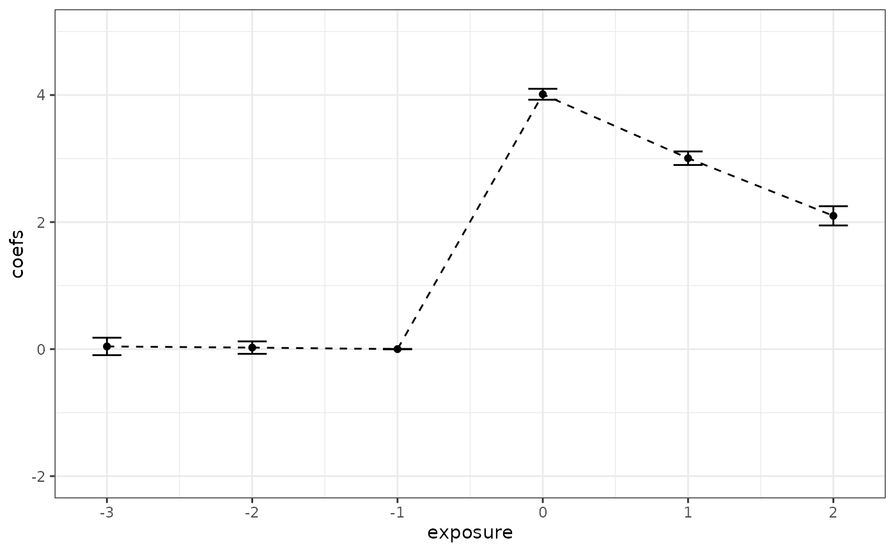
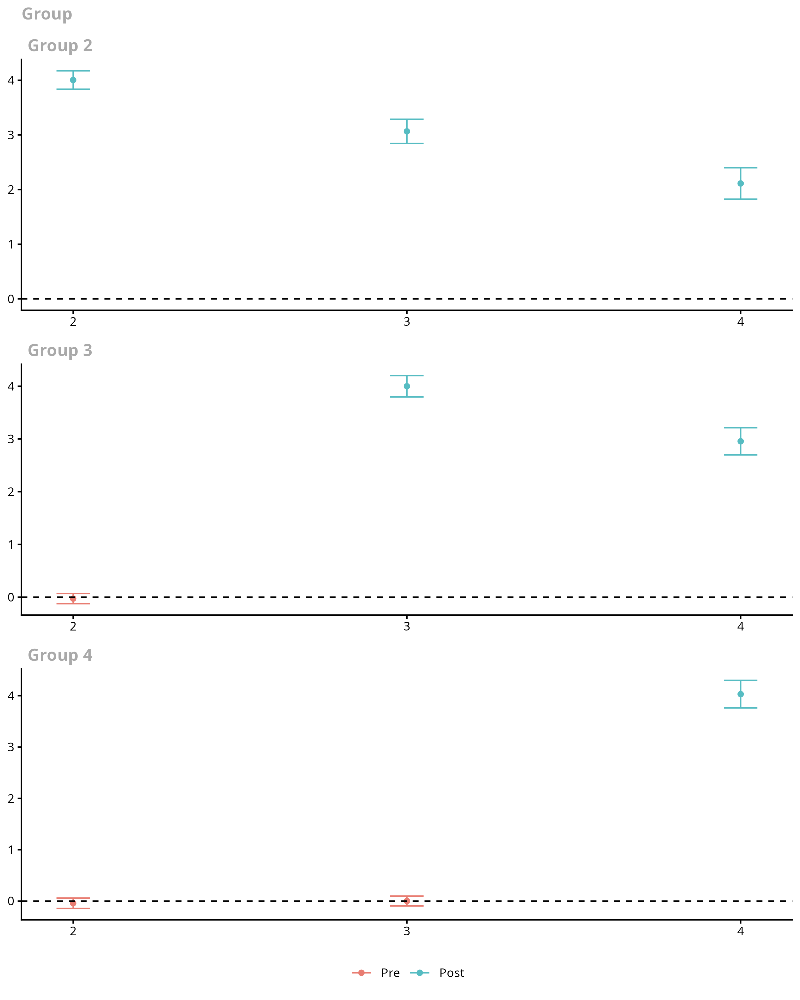
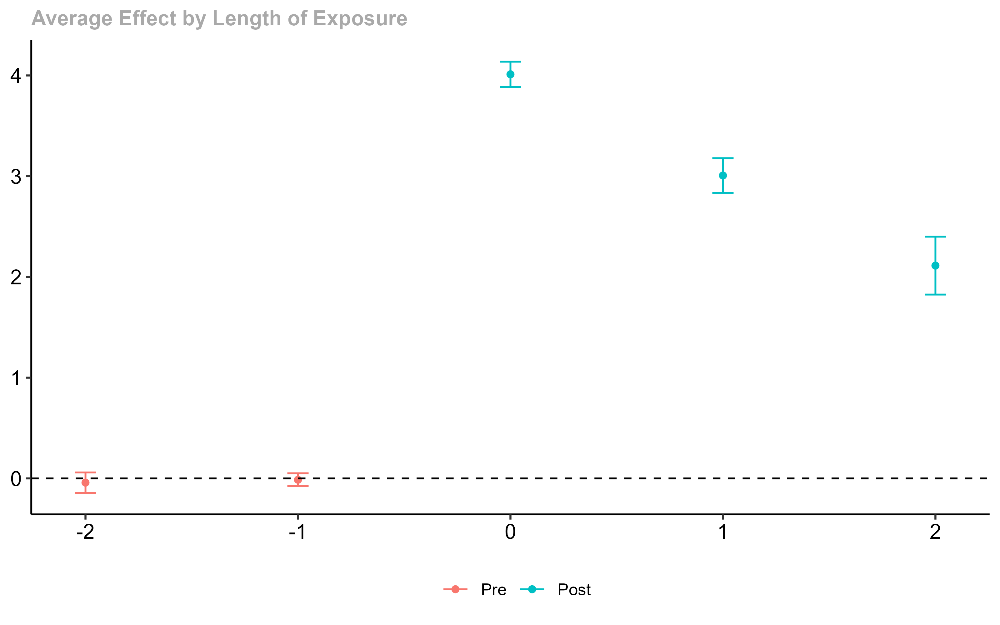
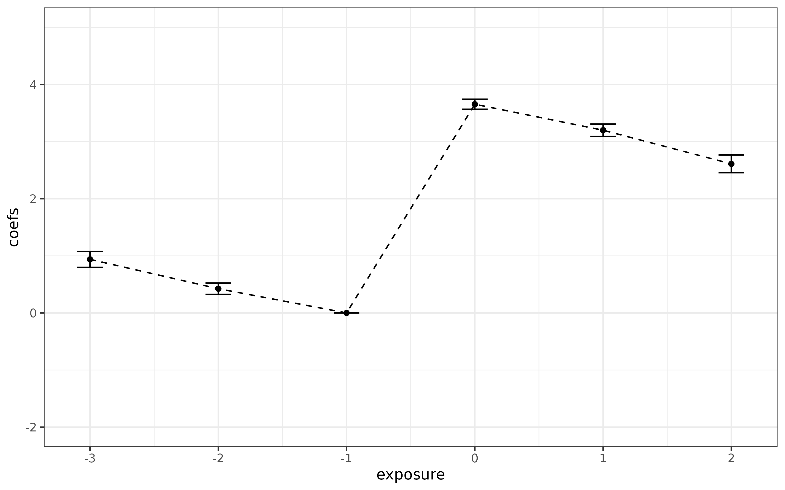
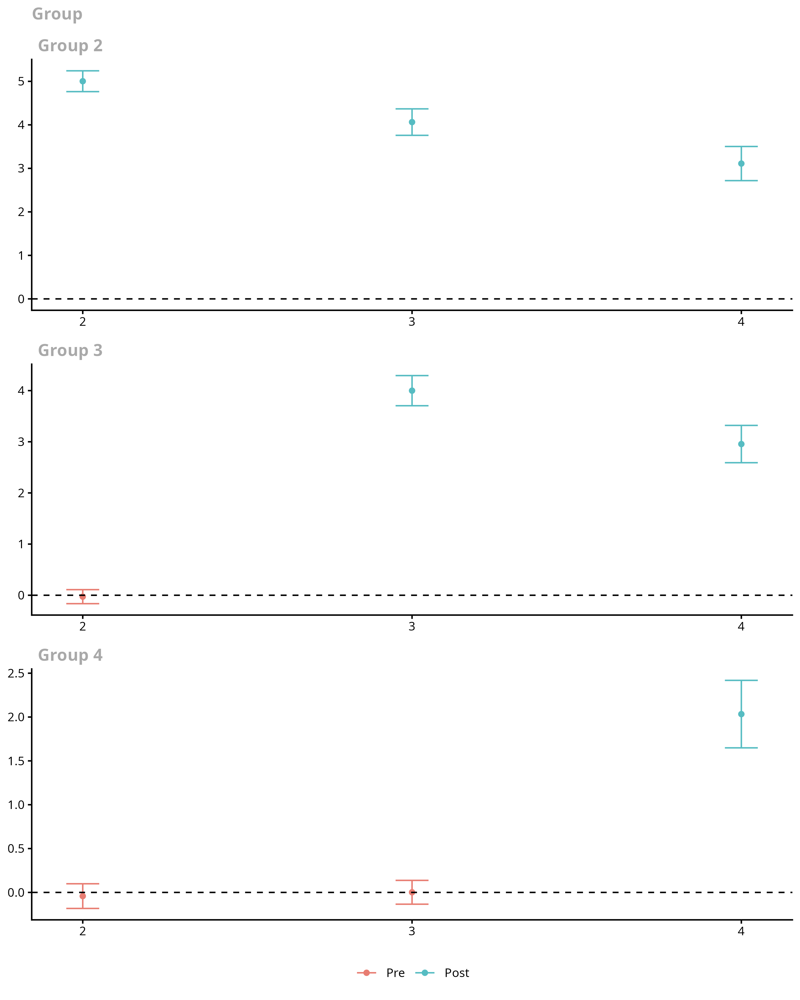
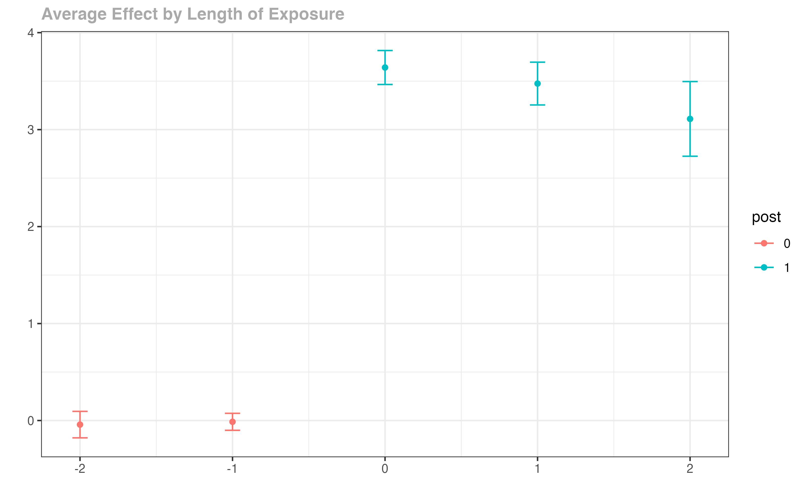

# Pre-Testing in a DiD Setup using the did Package

## Introduction

This vignette provides a discussion of how to conduct pre-tests in DiD
setups using the **did** package.

- One appealing feature of many DiD applications with multiple periods
  is that the researcher can pre-test the parallel trends assumptions.

  - The idea here is simple: although one cannot always test whether
    parallel trends itself holds, one can check if it holds in periods
    before treated units actually become treated.

  - Importantly, this is just a pre-test; it is different from an actual
    test. Whether or not the parallel trends assumption holds in
    pre-treatment periods does not actually tell you if it holds in the
    current period (and this is when you need it to hold!). It is
    certainly possible for the identifying assumptions to hold in
    previous periods but not hold in current periods; it is also
    possible for identifying assumptions to be violated in previous
    periods but for them to hold in current periods. That being said, we
    view the pre-test as a piece of evidence on the credibility of the
    DiD design in a particular application.

- In this vignette, we demonstrate that the approach used in the **did**
  package for pre-testing may work substantially better than the more
  common “event study regression”.

## Common Approaches to Pre-Testing in Applications

By far the most common approach to pre-testing in applications is to run
an **event-study regression**. Here, the idea is to run a regression
that includes leads and lags of the treatment dummy variable such as
$$Y_{it} = \theta_{t} + \eta_{i} + \sum\limits_{l = - \mathcal{T}}^{\mathcal{T} - 1}D_{it}^{l}\mu_{l} + v_{it}$$

where $D_{it}^{l} = 1$ if individual $i$ has been exposed to the
treatment for $l$ periods in period $t$, and $D_{it}^{l} = 0$ otherwise.
To be clear here, it is helpful to give some examples. Suppose
individual $i$ becomes treated in period 3. Then,

- $D_{it}^{0} = 1$ when $t = 3$ and is equal to 0 in other time periods

- $D_{it}^{2} = 1$ when $t = 5$ and is equal to 0 in other time periods

- $D_{it}^{- 2} = 1$ when $t = 1$ and is equal to 0 in other time
  periods.

And $\mu_{l}$ is interpreted as the effect of treatment for different
lengths of exposure to the treatment. Typically, $\mu_{- 1}$ is
normalized to be equal to 0, and we follow that convention here. It is
common to interpret estimated $\mu_{l}$’s with $l < 0$ as a way to
pre-test the parallel trends assumption.

### Pitfalls with Event Study Regressions

#### Best Case Scenario for Pre-Testing

First, let’s start with a case where an event study regression is going
to work well for pre-testing the parallel trends assumption

``` r
# generate dataset with 4 time periods
time.periods <- 4

# generate dynamic effects
te.e <- time.periods:1

# generate data set with these parameters
# (main thing: it generates a dataset that satisfies
# parallel trends in all periods...including pre-treatment)
data <- build_sim_dataset()

head(data)
#>       G        X id period         Y treat
#> 1     2 0.530541  1      1  4.264584     1
#> 8001  2 0.530541  1      2 10.159789     1
#> 16001 2 0.530541  1      3  9.482624     1
#> 24001 2 0.530541  1      4 10.288278     1
#> 2     4 1.123550  2      1  3.252148     1
#> 8002  4 1.123550  2      2  7.038382     1
```

The main thing to notice here:

- The dynamics are common across all groups. This is the case where an
  event-study regression will work.

Next, a bit more code

``` r
#-----------------------------------------------------------------------------
# modify the dataset a bit so that we can run an event study
#-----------------------------------------------------------------------------

# generate leads and lags of the treatment
Dtl <- sapply(-(time.periods-1):(time.periods-2), function(l) {
    dtl <- 1*( (data$period == data$G + l) & (data$G > 0) )
    dtl
})
Dtl <- as.data.frame(Dtl)
cnames1 <- paste0("Dtmin", (time.periods-1):1)
colnames(Dtl) <- c(cnames1, paste0("Dt", 0:(time.periods-2)))
data <- cbind.data.frame(data, Dtl)
row.names(data) <- NULL

head(data)
#>   G        X id period         Y treat Dtmin3 Dtmin2 Dtmin1 Dt0 Dt1 Dt2
#> 1 2 0.530541  1      1  4.264584     1      0      0      1   0   0   0
#> 2 2 0.530541  1      2 10.159789     1      0      0      0   1   0   0
#> 3 2 0.530541  1      3  9.482624     1      0      0      0   0   1   0
#> 4 2 0.530541  1      4 10.288278     1      0      0      0   0   0   1
#> 5 4 1.123550  2      1  3.252148     1      1      0      0   0   0   0
#> 6 4 1.123550  2      2  7.038382     1      0      1      0   0   0   0

#-----------------------------------------------------------------------------
# run the event study regression
#-----------------------------------------------------------------------------

# load plm package
library(plm)

# run event study regression
# normalize effect to be 0 in pre-treatment period
es <- plm(Y ~ Dtmin3 + Dtmin2 + Dt0 + Dt1 + Dt2, 
          data = data, model = "within", effect = "twoways",
          index = c("id", "period"))

summary(es)
#> Twoways effects Within Model
#> 
#> Call:
#> plm(formula = Y ~ Dtmin3 + Dtmin2 + Dt0 + Dt1 + Dt2, data = data, 
#>     effect = "twoways", model = "within", index = c("id", "period"))
#> 
#> Balanced Panel: n = 6988, T = 4, N = 27952
#> 
#> Residuals:
#>    Min. 1st Qu.  Median 3rd Qu.    Max. 
#> -9.8577 -0.7595  0.0066  0.7640 11.6570 
#> 
#> Coefficients:
#>        Estimate Std. Error t-value Pr(>|t|)    
#> Dtmin3 0.041851   0.070134  0.5967   0.5507    
#> Dtmin2 0.023539   0.050044  0.4704   0.6381    
#> Dt0    4.012515   0.043824 91.5602   <2e-16 ***
#> Dt1    3.005615   0.054473 55.1767   <2e-16 ***
#> Dt2    2.098672   0.077281 27.1565   <2e-16 ***
#> ---
#> Signif. codes:  0 '***' 0.001 '**' 0.01 '*' 0.05 '.' 0.1 ' ' 1
#> 
#> Total Sum of Squares:    82617
#> Residual Sum of Squares: 55795
#> R-Squared:      0.32466
#> Adj. R-Squared: 0.099232
#> F-statistic: 2014.84 on 5 and 20956 DF, p-value: < 2.22e-16

#-----------------------------------------------------------------------------
# make an event study plot
#-----------------------------------------------------------------------------

# some housekeeping for making the plot
# add 0 at event time -1
coefs1 <- coef(es)
ses1 <- sqrt(diag(summary(es)$vcov))
idx.pre <- 1:(time.periods-2)
idx.post <- (time.periods-1):length(coefs1)
coefs <- c(coefs1[idx.pre], 0, coefs1[idx.post])
ses <- c(ses1[idx.pre], 0, ses1[idx.post])
exposure <- -(time.periods-1):(time.periods-2)

cmat <- data.frame(coefs=coefs, ses=ses, exposure=exposure)

library(ggplot2)

ggplot(data = cmat, mapping = aes(y = coefs, x = exposure)) +
  geom_line(linetype = "dashed") +
  geom_point() + 
  geom_errorbar(aes(ymin = (coefs-1.96*ses), ymax = (coefs+1.96*ses)), width = 0.2) +
  ylim(c(-2, 5)) +
  theme_bw()
```



You will notice that everything looks good here. The pre-test performs
well (the caveat to this is that the standard errors are “pointwise” and
would be better to have uniform confidence bands though this does not
seem to be standard practice in applications).

We can compare this to what happens using the `did` package:

``` r
# estimate group-time average treatment effects
did_att_gt <- att_gt(yname = "Y",
                     tname = "period",
                     idname = "id",
                     gname = "G",
                     data = data,
                     bstrap = FALSE,
                     cband = FALSE)
summary(did_att_gt)
#> 
#> Call:
#> att_gt(yname = "Y", tname = "period", idname = "id", gname = "G", 
#>     data = data, bstrap = FALSE, cband = FALSE)
#> 
#> Reference: Callaway, Brantly and Pedro H.C. Sant'Anna.  "Difference-in-Differences with Multiple Time Periods." Journal of Econometrics, Vol. 225, No. 2, pp. 200-230, 2021. <https://doi.org/10.1016/j.jeconom.2020.12.001>, <https://arxiv.org/abs/1803.09015> 
#> 
#> Group-Time Average Treatment Effects:
#>  Group Time ATT(g,t) Std. Error [95% Pointwise  Conf. Band]  
#>      2    2   4.0048     0.0859          3.8364      4.1732 *
#>      2    3   3.0652     0.1129          2.8438      3.2865 *
#>      2    4   2.1123     0.1466          1.8249      2.3997 *
#>      3    2  -0.0276     0.0491         -0.1237      0.0685  
#>      3    3   3.9993     0.1033          3.7968      4.2018 *
#>      3    4   2.9554     0.1315          2.6976      3.2132 *
#>      4    2  -0.0420     0.0516         -0.1433      0.0592  
#>      4    3   0.0016     0.0491         -0.0946      0.0977  
#>      4    4   4.0304     0.1369          3.7620      4.2988 *
#> ---
#> Signif. codes: `*' confidence band does not cover 0
#> 
#> P-value for pre-test of parallel trends assumption:  0.79239
#> Control Group:  Never Treated,  Anticipation Periods:  0
#> Estimation Method:  Doubly Robust

# plot them
ggdid(did_att_gt)
```



``` r
# aggregate them into event study plot
did_es <- aggte(did_att_gt, type = "dynamic")

# plot the event study
ggdid(did_es)
```



Overall, everything looks good using either approach. (Just to keep
things fair, we report pointwise confidence intervals for group-time
average treatment effects, but it is easy to get uniform confidence
bands by setting the options `bstrap=TRUE, cband=TRUE` to the call to
`att_gt`.)

#### Pitfall: Selective Treatment Timing

Sun and Abraham (2021) point out a major limitation of event study
regressions: when there is **selective treatment timing** the $\mu_{l}$
end up being weighted averages of treatment effects *across different
lengths of exposures*.

**Selective treatment timing** means that individuals in different
groups experience systematically different effects of participating in
the treatment from individuals in other groups. For example, there would
be selective treatment timing if individuals choose to be treated in
earlier periods if they tend to experience larger benefits from
participating in the treatment. This sort of selective treatment timing
is likely to be present in many applications in economics / policy
evaluation.

Contrary to event study regressions, pre-tests based on group-time
average treatment effects (or based on group-time average treatment
effects that are aggregated into an event study plot) **are still valid
even in the presence of selective treatment timing**.

To see this in action, let’s keep the same example as before, but add
selective treatment timing.

``` r
# generate dataset with 4 time periods
time.periods <- 4

# generate dynamic effects
te.e <- time.periods:1

# generate selective treatment timing
# (*** this is what is different here ***)
te.bet.ind <- time.periods:1 / (time.periods/2)

# generate data set with these parameters
# (main thing: it generates a dataset that satisfies
# parallel trends in all periods...including pre-treatment)
data <- build_sim_dataset()
```

``` r
# run through same code as in earlier example...omitted
```

``` r
# run event study regression
# normalize effect to be 0 in pre-treatment period
es <- plm(Y ~ Dtmin3 + Dtmin2 + Dt0 + Dt1 + Dt2, 
          data = data, model = "within", effect = "twoways", 
          index = c("id", "period"))

summary(es)
#> Twoways effects Within Model
#> 
#> Call:
#> plm(formula = Y ~ Dtmin3 + Dtmin2 + Dt0 + Dt1 + Dt2, data = data, 
#>     effect = "twoways", model = "within", index = c("id", "period"))
#> 
#> Balanced Panel: n = 6988, T = 4, N = 27952
#> 
#> Residuals:
#>     Min.  1st Qu.   Median  3rd Qu.     Max. 
#> -10.1582  -0.7512   0.0234   0.8058  11.1902 
#> 
#> Coefficients:
#>        Estimate Std. Error t-value  Pr(>|t|)    
#> Dtmin3 0.938180   0.071538 13.1144 < 2.2e-16 ***
#> Dtmin2 0.424155   0.051047  8.3092 < 2.2e-16 ***
#> Dt0    3.655215   0.044701 81.7695 < 2.2e-16 ***
#> Dt1    3.199891   0.055563 57.5898 < 2.2e-16 ***
#> Dt2    2.610583   0.078828 33.1173 < 2.2e-16 ***
#> ---
#> Signif. codes:  0 '***' 0.001 '**' 0.01 '*' 0.05 '.' 0.1 ' ' 1
#> 
#> Total Sum of Squares:    79441
#> Residual Sum of Squares: 58052
#> R-Squared:      0.26925
#> Adj. R-Squared: 0.025329
#> F-statistic: 1544.28 on 5 and 20956 DF, p-value: < 2.22e-16
```

``` r
# run through same code as before...omitted

# new event study plot
ggplot(data = cmat, mapping = aes(y = coefs, x = exposure)) +
  geom_line(linetype = "dashed") +
  geom_point() + 
  geom_errorbar(aes(ymin = (coefs-1.96*ses), ymax = (coefs+1.96*ses)), width = 0.2) +
  ylim(c(-2, 5)) +
  theme_bw()
```



In contrast to the last case, it is clear that things have gone wrong
here. **Parallel trends holds in all time periods and for all groups
here**, but the event study regression incorrectly rejects that parallel
trends holds – this is due to the selective treatment timing.

We can compare this to what happens using the `did` package:

``` r
# estimate group-time average treatment effects
did.att.gt <- att_gt(yname = "Y",
                     tname = "period",
                     idname = "id",
                     gname = "G",
                     data = data
                     )
summary(did.att.gt)
#> 
#> Call:
#> att_gt(yname = "Y", tname = "period", idname = "id", gname = "G", 
#>     data = data)
#> 
#> Reference: Callaway, Brantly and Pedro H.C. Sant'Anna.  "Difference-in-Differences with Multiple Time Periods." Journal of Econometrics, Vol. 225, No. 2, pp. 200-230, 2021. <https://doi.org/10.1016/j.jeconom.2020.12.001>, <https://arxiv.org/abs/1803.09015> 
#> 
#> Group-Time Average Treatment Effects:
#>  Group Time ATT(g,t) Std. Error [95% Simult.  Conf. Band]  
#>      2    2   5.0030     0.0868        4.7636      5.2423 *
#>      2    3   4.0634     0.1104        3.7590      4.3677 *
#>      2    4   3.1105     0.1424        2.7180      3.5029 *
#>      3    2  -0.0276     0.0497       -0.1646      0.1095  
#>      3    3   3.9993     0.1069        3.7047      4.2939 *
#>      3    4   2.9554     0.1323        2.5909      3.3200 *
#>      4    2  -0.0420     0.0511       -0.1828      0.0987  
#>      4    3   0.0016     0.0493       -0.1343      0.1374  
#>      4    4   2.0335     0.1396        1.6487      2.4182 *
#> ---
#> Signif. codes: `*' confidence band does not cover 0
#> 
#> P-value for pre-test of parallel trends assumption:  0.79239
#> Control Group:  Never Treated,  Anticipation Periods:  0
#> Estimation Method:  Doubly Robust

# plot them
ggdid(did.att.gt)
```



``` r
# aggregate them into event study plot
did.es <- aggte(did.att.gt, type = "dynamic")

# plot the event study
ggdid(did.es)
```



This is the correct performance (up to aforementioned caveats about
multiple hypothesis testing).

## Conditional Moment Tests

Another main use case for the `did` package is when the parallel trends
assumptions holds after conditioning on some covariates. This is likely
to be important in many applications. For example, to evaluate the
effect of participating in a job training program on earnings, it is
likely to be important to condition on an individual’s education. This
would be true if (i) the distribution of education is different for
individuals that participate in job training relative to those that
don’t (this is very likely to hold as people that participate in job
training tend to have less education than those who do not), and (ii) if
the path of earnings (absent participating in job training) depends on
an individual’s education. See Heckman, Ichimura, and Todd (1998) and
Abadie (2005) for more discussion.

Even when one includes covariates to estimate group-time average
treatment effects, pre-tests based only on group-time average treatment
effects can fail to detect some violations of the parallel trends
assumption. To give an example, suppose that the only covariate is
binary variable for an individual’s sex. Pre-tests based on group-time
average treatment effects could fail to detect violations of the
conditional parallel trends assumption in cases where it is violated in
one direction for men and in the other direction for women.

The `did` package contains an additional pre-test for the conditional
parallel trends assumption in the `conditional_did_pretest` function.

``` r
# not run (this code can be substantially slower)
reset.sim()
set.seed(1814)
nt <- 1000
nu <- 1000
cdp <- conditional_did_pretest("Y", "period", "id", "G", xformla = ~X, data = data)
cdp
```

## References

- [Abadie, Alberto. “Semiparametric difference-in-differences
  estimators.” The Review of Economic Studies 72.1 (2005):
  1-19.](https://doi.org/10.1111/0034-6527.00321)

- [Callaway, Brantly, and Pedro H. C. Sant’Anna.
  “Difference-in-differences with multiple time periods.” Journal of
  Econometrics, Vol. 225, No. 2, pp. 200-230,
  2021](https://doi.org/10.1016/j.jeconom.2020.12.001).

- [Heckman, James J., Hidehiko Ichimura, and Petra Todd. “Matching as an
  econometric evaluation estimator.” The Review of Economic Studies 65.2
  (1998): 261-294.](https://doi.org/10.2307/2971733)

- [Sun, Liyang, and Sarah Abraham. “Estimating dynamic treatment effects
  in event studies with heterogeneous treatment effects.” Journal of
  Econometrics, Vol. 225, No. 2, pp. 175-199,
  2021](https://doi.org/10.1016/j.jeconom.2020.09.006)
