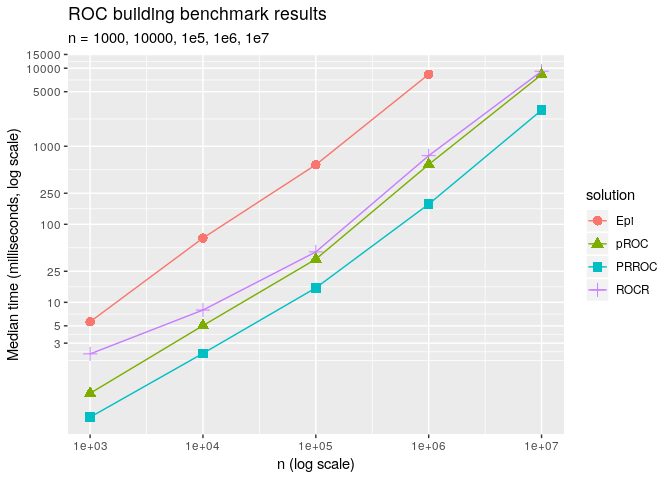

<!-- README.md is generated from README.Rmd. Please edit that file -->

# Benchmarks

These benchmarks compare pROC with competing ROC analysis packages in R.
They can serve as a way to detect performance bottleneck that must be
fixed, and possible regressions in performance.

The benchmarking are carried out with the **microbenchmark** package and
randomly generated data. The values of the `x` predictor variable are
drawn from a normal distribution, resulting in every value being
essentially unique. Predictor values for positive examples are increased
to have a mean of 1, resulting in ROC curves with an AUC of 0.76.

<!-- TODO: bench with rounded or fewer unique values -->

The benchmark code is adapted from the [cutpointr vignette by Christian
Thiele](https://github.com/Thie1e/cutpointr/blob/master/vignettes/cutpointr.Rmd),
released under a GPL-3 license.

## Building the ROC curve

This first benchmark looks at the time needed to building the ROC curve
only, and getting sensitivities, specificities and thresholds. Only
packages allowing turn off the calculation of the AUC, or not computing
it by default, were tested.

<!-- -->

|        n |         pROC |        ROCR |
| -------: | -----------: | ----------: |
|    1e+03 |    0.6579095 |    2.059954 |
|    1e+04 |    3.6905450 |    5.727894 |
|    1e+05 |   41.4205780 |   49.021695 |
|    1e+06 |  600.3593600 |  643.874491 |
|    1e+07 | 8220.1797555 | 9012.922116 |
| \#\# AUC |              |             |

This benchmark tests how long it takes to calculate the ROC curve and
the area under the ROC curve (AUC).

<!-- -->

|     n |         Epi |        pROC |      PRROC |        ROCR |
| ----: | ----------: | ----------: | ---------: | ----------: |
| 1e+03 |    5.635899 |    0.683097 |    0.33761 |    2.184626 |
| 1e+04 |   66.644144 |    5.037177 |    2.21852 |    7.965816 |
| 1e+05 |  579.622447 |   35.752837 |   15.31815 |   44.327074 |
| 1e+06 | 8352.085559 |  583.754913 |  181.14614 |  757.437651 |
| 1e+07 |          NA | 8276.516090 | 2899.50254 | 9149.835111 |

## Best threshold

Benchmarks packages that extract the “best” threshold. At the moment
they all use the Youden index. This includes building the ROC curve
first.

    #> Multiple optimal cutpoints found
    #> Multiple optimal cutpoints found
    #> Multiple optimal cutpoints found
    #> Multiple optimal cutpoints found
    #> Multiple optimal cutpoints found
    #> Multiple optimal cutpoints found
    #> Multiple optimal cutpoints found
    #> Multiple optimal cutpoints found
    #> Multiple optimal cutpoints found
    #> Multiple optimal cutpoints found
    #> Multiple optimal cutpoints found
    #> Multiple optimal cutpoints found
    #> Multiple optimal cutpoints found
    #> Multiple optimal cutpoints found
    #> Multiple optimal cutpoints found
    #> Multiple optimal cutpoints found
    #> Multiple optimal cutpoints found
    #> Multiple optimal cutpoints found
    #> Multiple optimal cutpoints found
    #> Multiple optimal cutpoints found

<!-- -->

|     n |   cutpointr | OptimalCutpoints |        pROC | ThresholdROC |
| ----: | ----------: | ---------------: | ----------: | -----------: |
| 1e+02 |    4.779029 |         1.959683 |    0.569432 |     1.032499 |
| 1e+03 |    5.395060 |        30.739701 |    1.034866 |    22.389875 |
| 1e+04 |    7.195595 |      2902.387499 |    4.311928 |  2018.123223 |
| 1e+05 |   26.105981 |               NA |   39.171103 |           NA |
| 1e+06 |  276.263793 |               NA |  579.522941 |           NA |
| 1e+07 | 4258.031252 |               NA | 8329.708682 |           NA |
