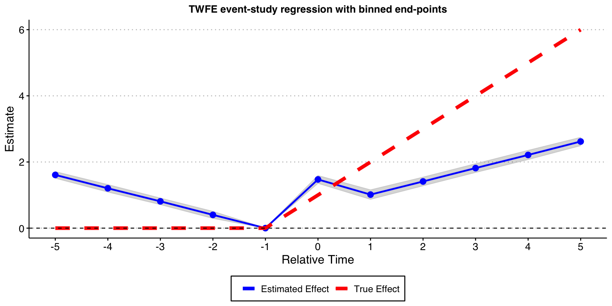
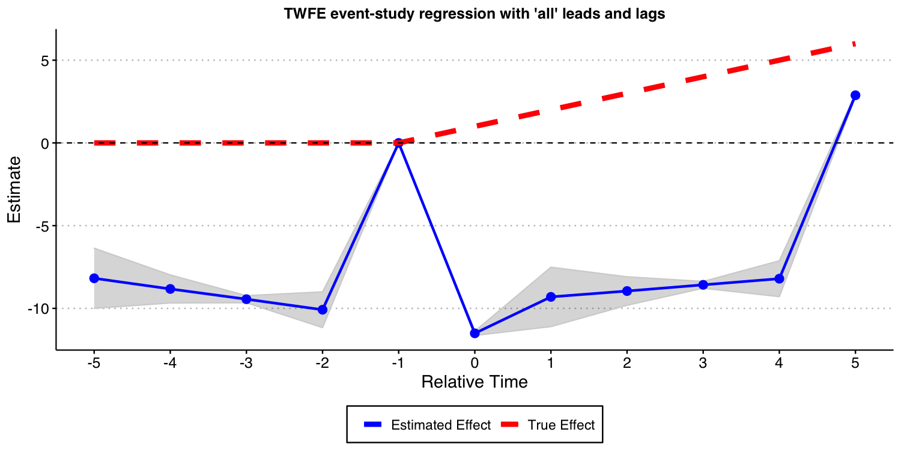
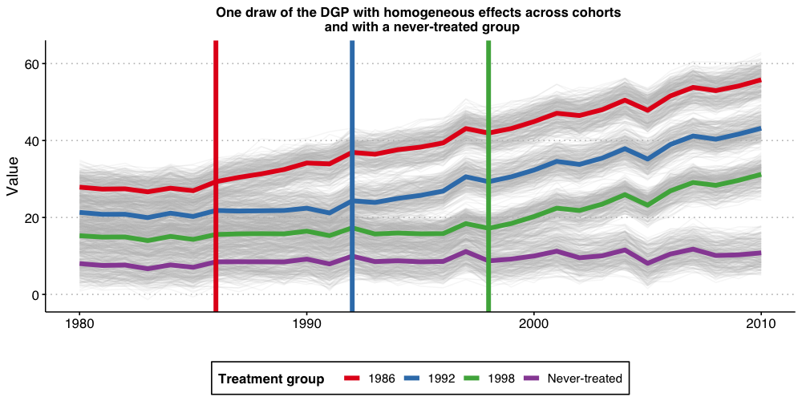
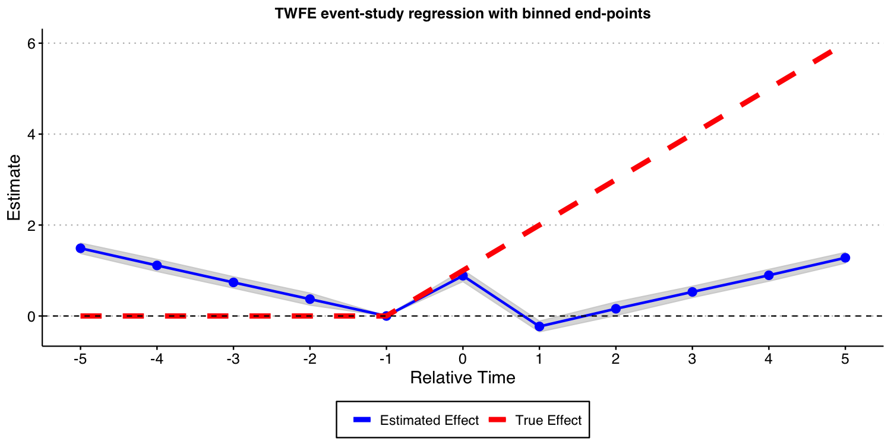
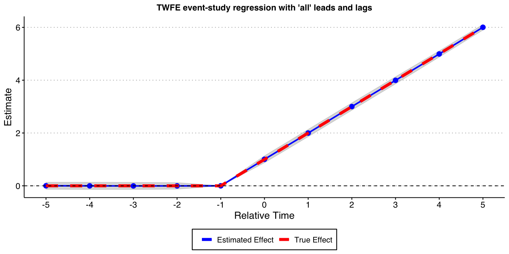
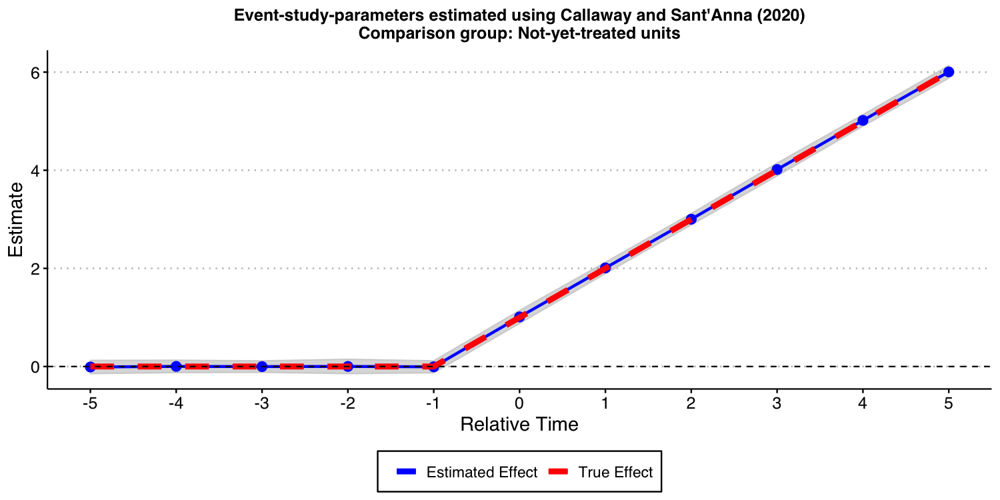
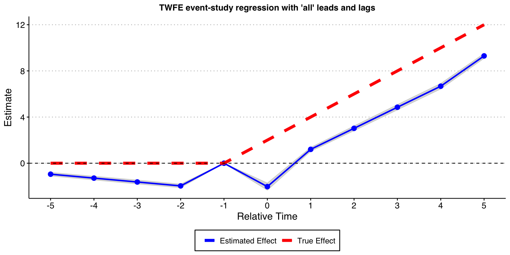
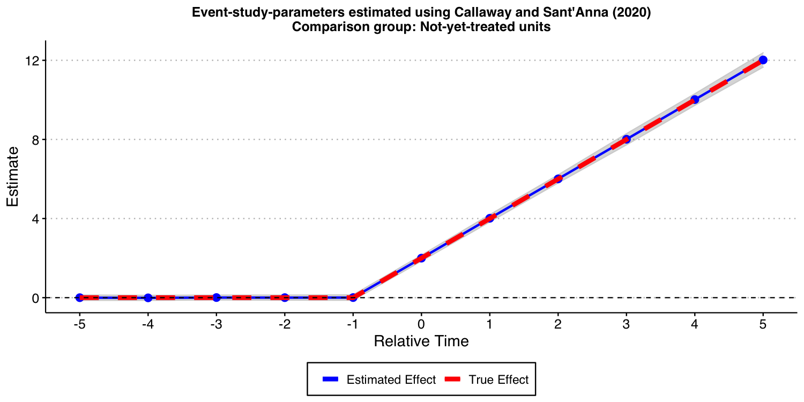

```{r setup2, include = FALSE}
knitr::opts_chunk$set(
  collapse = TRUE,
  comment = "#>",
  echo = TRUE,
  eval = FALSE
)
```


## Introduction

In this vignette, we want to illustrate the dangers of relying on traditional two-way fixed-effects (TWFE) regression models with leads and lags to conduct causal inference about treatment effect dynamics. In fact, we will show that *even* when treatment effect dynamics are homogeneous across different treatment groups/cohorts, some of these TWFE regression models can be severely biased. 


In order to effectively communicate these dangers, we consider a stylized simulation example where covariates do not play any major role. This example draws from several discussions we have had with Andrew Baker. We consider three setups. In the first one all units are eventually treated, and treatment effect dynamics are homogeneous across treatment groups. In the second, we have a group of units that remain untreated at the end of our sample, and treatment effect dynamics are homogeneous across treatment groups. The third one is like the second, but with heterogeneous treatment effect dynamics across treatment groups.


## Setup with all units being eventually treated and homogeneous treatment effect dynamics

Consider a staggered treatment adoption setup where 40 'states' ($state = \{1,2,\dots,40\}$) are randomly assigned into 4 treatment groups depending on the treatment starting year (1986, 1992, 1998, and 2004). We denote the treatment starting period as $g$ with ($g \in \{ 1986, 1992, 1998, 2004\}$). The 1000 units (e.g., 'counties' or 'firms') $i$ in the sample are randomly assigned to one of the 40 states. Let $G_i$ indicates the group/cohort unit $i$ belongs to, i.e., $G \subseteq \{ 1986, 1992, 1998, 2004\}$.


The data generating process (DGP) for the outcome $Y$ we consider is 
$$Y_{i,t} = (2010-g) + \alpha_i + \alpha_t + \tau_{i,t} + \epsilon_{i,t}$$
where $\alpha_i$ are unit fixed effects drawn from $\sim N(\mu_{state}, 1)$ with state-specific mean $\mu_{state} = state/5$, $\alpha_t$ are time fixed effects (cohort specific parallel time-trends) generated as $$\alpha_t = 0.1 * (t - g) + \epsilon^{time FE}_t, $$ with $\epsilon^{time FE}_t \sim N(0, 1)$, $\epsilon_{i,t} \sim N\left(0, \left(\frac{1}{2}\right)^2\right)$ is an idiosyncratic error term, and $\tau_{i,t}$ are the unit-specific treatment effects at time $t$ generated as 
$$ \tau_{i,t} = \mu \times (t - g + 1)\times 1\{t \ge g \},$$
where $\mu$ is the the instantaneous treatment effect; we set $\mu=1$.


From the above DGP, it is evident that the ATT at the time a unit is treated is equal to 1 for all groups, it is equal to 2 one period after treatment started for all groups, etc. Thus, the evolution of the treatment effects is homogeneous across treatment groups. This is an *a priori* strong restriction that should make things "easier" to estimate (but is by no means required!).

### Visualizing the DGP
Let's start the discussion by first visualizing how the DGP looks like.

```{r DGP_viz, message = FALSE, warning = FALSE, cache = TRUE, cache.lazy = TRUE, fig.width=8,fig.height=5, fig.align='center', out.width="90%", dpi = 200}
# Load libraries and set baseline parameters
library(tidyverse)
library(lfe)
library(fastDummies)
library(ggthemes)
library(did)
theme_set(theme_clean() + theme(plot.background = element_blank()))
#----------------------------------------------------------------------------
iseed  = 20201221
nrep <- 100  
true_mu <- 1
set.seed(iseed)

#----------------------------------------------------------------------------
## Generate data - treated cohorts consist of 250 obs each, with the treatment effect still = true_mu on average
make_data <- function(nobs = 1000, 
                      nstates = 40) {
  
  # unit fixed effects (unobservd heterogeneity)
  unit <- tibble(
    unit = 1:nobs,
    # generate state
    state = sample(1:nstates, nobs, replace = TRUE),
    unit_fe = rnorm(nobs, state/5, 1),
    # generate instantaneous treatment effect
    #mu = rnorm(nobs, true_mu, 0.2)
    mu = true_mu
  )
  
  # year fixed effects (first part)
  year <- tibble(
    year = 1980:2010,
    year_fe = rnorm(length(year), 0, 1)
  )
  
  # Put the states into treatment groups
  treat_taus <- tibble(
    # sample the states randomly
    state = sample(1:nstates, nstates, replace = FALSE),
    # place the randomly sampled states into four treatment groups G_g
    cohort_year = sort(rep(c(1986, 1992, 1998, 2004), 10))
  )
  
  # make main dataset
  # full interaction of unit X year 
  expand_grid(unit = 1:nobs, year = 1980:2010) %>% 
    left_join(., unit) %>% 
    left_join(., year) %>% 
    left_join(., treat_taus) %>% 
    # make error term and get treatment indicators and treatment effects
    # Also get cohort specific trends (modify time FE)
    mutate(error = rnorm(nobs*31, 0, 1),
           treat = ifelse(year >= cohort_year, 1, 0),
           tau = ifelse(treat == 1, mu, 0),
           year_fe = year_fe + 0.1*(year - cohort_year)
    ) %>% 
    # calculate cumulative treatment effects
    group_by(unit) %>% 
    mutate(tau_cum = cumsum(tau)) %>% 
    ungroup() %>% 
    # calculate the dep variable
    mutate(dep_var = (2010 - cohort_year) + unit_fe + year_fe + tau_cum + error)
  
}
#----------------------------------------------------------------------------
# make data
data <- make_data()

# plot
plot1 <- data %>% 
  ggplot(aes(x = year, y = dep_var, group = unit)) + 
  geom_line(alpha = 1/8, color = "grey") + 
  geom_line(data = data %>% 
              group_by(cohort_year, year) %>% 
              summarize(dep_var = mean(dep_var)),
            aes(x = year, y = dep_var, group = factor(cohort_year),
                color = factor(cohort_year)),
            size = 2) + 
  labs(x = "", y = "Value", color = "Treatment group   ") + 
  geom_vline(xintercept = 1986, color = '#E41A1C', size = 2) + 
  geom_vline(xintercept = 1992, color = '#377EB8', size = 2) + 
  geom_vline(xintercept = 1998, color = '#4DAF4A', size = 2) + 
  geom_vline(xintercept = 2004, color = '#984EA3', size = 2) + 
  scale_color_brewer(palette = 'Set1') + 
  theme(legend.position = 'bottom',
        #legend.title = element_blank(), 
        axis.title = element_text(size = 14),
        axis.text = element_text(size = 12))  +
  ggtitle("One draw of the DGP with homogeneous effects across cohorts \n and with all groups being eventually treated")+
  theme(plot.title = element_text(hjust = 0.5, size=12))

plot1

#ggsave("plot_dgp1.png", plot1, width = 10, height = 5, dpi = 100)
```
{ width=100% }

The above plot shows the 1,000 individual values of $Y_{i,t}$, as well as the average by treatment-group (the thicker colorful lines), and the vertical lines show the period when treatment begins for each group. Because treatment effects here grows linearly with time elapsed since treatment started, we can see that the earliest treated units end up with the highest value of Y, and that the difference grows by the gap between treatment years.


### Estimating dynamic treatment effects via TWFE event-study regressions

Given that we are interested in treatment effect dynamics, we then proceed to consider a classical two-way fixed-effects (TWFE) event study specification 
$$Y_{i,t} = \alpha_i + \alpha_t + \gamma_k^{-K}~ D_{i,t}^{<-K} + \sum_{k=-K}^{-2} \gamma_k^{lead} D_{i,t}^{k} +\sum_{k=0}^{L} \gamma_k^{lag} D_{i,t}^{k} + \gamma_k^{L+} D_{i,t}^{>L} + \varepsilon_{i,t}$$ 
where $D_{i,t}^{k}=1\{t-G_i=k\}$ is an "event-study" dummy variable that takes value one if a unit $i$ is $k$ periods away from initial treatment at time $t$ and zero otherwise, $D_{i,t}^{<-K}=1\{t-G_i<-K\}$ and $D_{i,t}^{>L}=1\{t-G_i>L\}$ are defined analogously. For instance, $D_{i,t}^{0}$ is equal to one if the unit $i$ is first treated at time $t$, $D_{i,t}^{1}$ is equal to one if a one period has passed since treatment started (treatment lags), etc. Alternatively we have that $D_{i,t}^{-2}$ is equal to one if a unit $i$ will be treated in two periods from $t$ (treatment leads). In this exercise we set $K$ and $L$ to be equal to 5.


Up to today, it is customary to interpret estimates of $\gamma_k^{lags}$ as ``good'' measures of the average treatment effect for being exposed to treatment for $k$ periods, and estimates of $\gamma_k^{leads}$ as measures of pre-trends. Our first exercise here is to assess if this is OK-ish. 


Towards this end, we will a perform Monte Carlo exercise where we generate data according to the DGP described above and estimate all the parameters of the TWFE event-study regression above. We repeat this 100 times (same holds true if we do 1,000) and plot the Monte Carlo mean and 1.96 times the Monte-Carlo standard-deviation of the relative time indicator dummies, as well as the true treatment effect below.


```{r ES1, message = FALSE, warning = FALSE, cache = TRUE, cache.lazy = TRUE, fig.width=8,fig.height=5, fig.align='center', out.width="90%", dpi = 200}
# function to run ES DID
# variables we will use
keepvars <- c("`rel_year_-5`",  "`rel_year_-4`",  "`rel_year_-3`",  "`rel_year_-2`",
              "rel_year_0", "rel_year_1", "rel_year_2", "rel_year_3", "rel_year_4", "rel_year_5")

run_ES_DiD <- function(...) {
  
  # resimulate the data
  data <- make_data()
  
  # make dummy columns
  data <- data %>% 
    # make dummies
    mutate(rel_year = year - cohort_year) %>% 
    dummy_cols(select_columns = "rel_year") %>% 
    # generate pre and post dummies
    mutate(Pre = ifelse(rel_year < -5, 1, 0),
           Post = ifelse(rel_year > 5, 1, 0))
  
  # estimate the model
  mod <- lfe::felm(dep_var ~ Pre + `rel_year_-5` + `rel_year_-4` + `rel_year_-3` + `rel_year_-2` + 
                `rel_year_0` + `rel_year_1` + `rel_year_2` + `rel_year_3` + `rel_year_4` + 
                `rel_year_5` + Post | unit + year | 0 | state, data = data, exactDOF = TRUE)
  
  # grab the obs we need
  mod2 <- tibble(
    estimate = mod$coefficients,
    term1 = rownames(mod$coefficients)
    )
  
 es <-
   mod2 %>% 
    filter(term1 %in% keepvars) %>% 
    mutate(t = c(-5:-2, 0:5)) %>% 
    select(t, estimate)
 es
}

data_classical <- map_dfr(1:nrep, run_ES_DiD)

colors <- c("True Effect" = "red", "Estimated Effect" = "blue")

ES_plot_classical <- data_classical %>% 
  group_by(t) %>% 
  summarize(avg = mean(estimate),
            sd = sd(estimate),
            lower.ci = avg - 1.96*sd,
            upper.ci = avg + 1.96*sd) %>% 
  bind_rows(tibble(t = -1, avg = 0, sd = 0, lower.ci = 0, upper.ci = 0)) %>% 
  mutate(true_tau = ifelse(t >= 0, (t + 1)* true_mu, 0)) %>% 
  ggplot(aes(x = t, y = avg)) + 
  #geom_linerange(aes(ymin = lower.ci, ymax = upper.ci), color = 'darkgrey', size = 2) + 
  geom_ribbon(aes(ymin = lower.ci, ymax = upper.ci), color = "lightgrey", alpha = 0.2) +
  geom_point(color = 'blue', size = 3) + 
  geom_line(aes(color = 'Estimated Effect'), size = 1) + 
  geom_line(aes(x = t, y = true_tau, color = 'True Effect'), linetype = "dashed", size = 2) + 
  geom_hline(yintercept = 0, linetype = "dashed") + 
  scale_x_continuous(breaks = -5:5) + 
  labs(x = "Relative Time", y = "Estimate") + 
  theme(axis.title = element_text(size = 14),
        axis.text = element_text(size = 12)) +
  ggtitle("TWFE event-study regression with binned end-points")+
  scale_color_manual(values = colors) + 
  theme(plot.title = element_text(hjust = 0.5, size=12),
        legend.position = "bottom", 
        legend.title = element_blank())

ES_plot_classical

#ggsave("es_plot_classical.png", ES_plot_classical, width = 10, height = 5, dpi = 150)
```

{ width=100% }

The results above show that these TWFE event-study type estimates are *severely biased* for the true treatment effects. Furthermore, using the estimates of coefficient of treatment leads as a way to find evidence of "pre-trends" is very problematic, as illustrated above; see Sun and Abraham (2021) for formal results! Putting it simply, the results above highlight that such TWFE linear regression should not be used to highlight treatment effect dynamics!


Now, you may wonder: What happens if I include all possible leads and lags in the TWFE event study specification, i.e., to set K and L to the maximum allowable in the data, making inclusion of $D_{i,t}^{<-K}$
and of $D_{i,t}^{>L}$ unnecessary. In what follows, we do exactly that, though we need to omit one extra period apart from -1 to avoid problems of multicollinearity identified by Borusyak and Jaravel (2018). We drop the most negative time period, which is perhaps the most natural thing to do. In order words, we set $K=23$ and $L=24$, and drop the  $D_{i,t}^{<-K}$ and $D_{i,t}^{>L}$ from the TWFE specification.


The result of this exercise is displayed below. And, as you can see, this still leads to *very biased* estimates for the causal effects of interest!

```{r ES3, message = FALSE, warning = FALSE, cache = TRUE, cache.lazy = TRUE, fig.width=8,fig.height=5, fig.align='center', out.width="90%", dpi = 200}
# function to run ES DID
run_ES_DiD_sat <- function(...) {
  
  # resimulate the data
  data <- make_data()
  
  # make dummy columns
  data <- data %>% 
    # make relative year indicator
    mutate(rel_year = year - cohort_year)
  
  # get the minimum relative year - we need this to reindex
  min_year <- min(data$rel_year)
  
  # reindex the relative years
  data <- data %>% 
    mutate(rel_year = rel_year - min_year) %>% 
    dummy_cols(select_columns = "rel_year")
  
  # make regression formula 
  indics <- paste("rel_year", (1:max(data$rel_year))[-(-1 - min_year)], sep = "_", collapse = " + ")
  keepvars <- paste("rel_year", c(-5:-2, 0:5) - min_year, sep = "_")  
  formula <- as.formula(paste("dep_var ~", indics, "| unit + year | 0 | state"))
  
  # run mod
  mod <- felm(formula, data = data, exactDOF = TRUE)
  
  # grab the obs we need
  mod2 <- tibble(
    estimate = mod$coefficients,
    term1 = rownames(mod$coefficients)
    )
  
 es <-
   mod2 %>% 
    filter(term1 %in% keepvars) %>% 
    mutate(t = c(-5:-2, 0:5)) %>% 
    select(t, estimate)
 es
}

data_sat <- map_dfr(1:nrep, run_ES_DiD_sat)

ES_plot_sat <- data_sat %>% 
  group_by(t) %>% 
  summarize(avg = mean(estimate),
            sd = sd(estimate),
            lower.ci = avg - 1.96*sd,
            upper.ci = avg + 1.96*sd) %>% 
  bind_rows(tibble(t = -1, avg = 0, sd = 0, lower.ci = 0, upper.ci = 0)) %>% 
  mutate(true_tau = ifelse(t >= 0, (t + 1)* true_mu, 0)) %>% 
  ggplot(aes(x = t, y = avg)) + 
  #geom_linerange(aes(ymin = lower.ci, ymax = upper.ci), color = 'darkgrey', size = 2) + 
  geom_ribbon(aes(ymin = lower.ci, ymax = upper.ci), color = "lightgrey", alpha = 0.2) +
  geom_point(color = 'blue', size = 3) + 
   geom_line(aes(color = 'Estimated Effect'), size = 1) + 
   geom_line(aes(x = t, y = true_tau, color = 'True Effect'), linetype = "dashed", size = 2) + 
  geom_hline(yintercept = 0, linetype = "dashed") + 
  scale_x_continuous(breaks = -5:5) + 
  labs(x = "Relative Time", y = "Estimate") + 
  theme(axis.title = element_text(size = 14),
        axis.text = element_text(size = 12)) +
  ggtitle("TWFE event-study regression with 'all' leads and lags")+
  scale_color_manual(values = colors) + 
  theme(plot.title = element_text(hjust = 0.5, size=12),
        legend.position = "bottom", 
        legend.title = element_blank())
        

ES_plot_sat

#ggsave("es_plot_sat.png", ES_plot_sat, width = 10, height = 5, dpi = 150)

```
{ width=100% }


### Using the Callaway and Sant'Anna (2021) framework

Instead of using variants of the TWFE specification above, we advocate you to use the procedure put forward by Callaway and Sant'Anna (2021) and implemented in our package **did**. 

In this specific DGP, as there is no "never-treated" units, we can use the "not-yet-treated" units as a valid comparison group for each cohort. Furthermore, since covariates are not available (and do not play any major role into the analysis), we do not need to worry about the underlying "est_method".

Below we show the results associated with using the Callaway and Sant'Anna (2021) procedure. As you can see, you get reliable and precise estimates for treatment effect dynamics. This is good news!
```{r CS, message = FALSE, warning = FALSE, cache = TRUE, cache.lazy = TRUE, fig.width=8,fig.height=5, fig.align='center', out.width="90%", dpi = 200}
# function to run ES DID
run_CS <- function(...) {
  
  # resimulate the data
  data <- make_data()
  
  mod <- did::att_gt(yname = "dep_var", 
                     tname = "year",
                     idname = "unit",
                     gname = "cohort_year",
                     control_group= "notyettreated",
                     bstrap = FALSE,
                     data = data,
                     print_details = FALSE)
  event_std <- did::aggte(mod, type = "dynamic")
  
  att.egt <- event_std$att.egt
  names(att.egt) <- event_std$egt
  
  # grab the obs we need
  broom::tidy(att.egt) %>% 
    filter(names %in% -5:5) %>% 
    mutate(t = -5:5, estimate = x) %>% 
    select(t, estimate)
}

data_CS <- map_dfr(1:nrep, run_CS)

ES_plot_CS <- data_CS %>% 
  group_by(t) %>% 
  summarize(avg = mean(estimate),
            sd = sd(estimate),
            lower.ci = avg - 1.96*sd,
            upper.ci = avg + 1.96*sd) %>% 
  mutate(true_tau = ifelse(t >= 0, (t + 1)* true_mu, 0)) %>% 
  ggplot(aes(x = t, y = avg)) + 
  #geom_linerange(aes(ymin = lower.ci, ymax = upper.ci), color = 'darkgrey', size = 2) + 
  geom_ribbon(aes(ymin = lower.ci, ymax = upper.ci), color = "lightgrey", alpha = 0.2) +
  geom_point(color = 'blue', size = 3) + 
   geom_line(aes(color = 'Estimated Effect'), size = 1) + 
   geom_line(aes(x = t, y = true_tau, color = 'True Effect'), linetype = "dashed", size = 2) + 
  geom_hline(yintercept = 0, linetype = "dashed") + 
  scale_x_continuous(breaks = -5:5) + 
  labs(x = "Relative Time", y = "Estimate") + 
  theme(axis.title = element_text(size = 14),
        axis.text = element_text(size = 12)) +
  ggtitle("Event-study-parameters estimated using Callaway and Sant'Anna (2021)\nComparison group: Not-yet-treated")+
    scale_color_manual(values = colors) + 
  theme(plot.title = element_text(hjust = 0.5, size=12),
        legend.position = "bottom", 
        legend.title = element_blank())

ES_plot_CS

#ggsave("es_plot_CS.png", ES_plot_CS, width = 10, height = 5, dpi = 150)

```
{ width=100% }

## Setup with a group that remains untreated at the end of the sample

One of the features of the above DGP is that all units eventually get treated. In some applications, we have that a group of units remain untreated at the end of the sample. We call this group of units the "never-treated" group. To assess if the problems associated with TWFE specification highlighted above persist if such a group of units is available, we modify a little bit the DGP and repeat the same exercise as above.


### DGP with a "never-treated" group and homogeneous treatment effect dynamics

The DGP we consider is very similar to the one we have already considered. The only difference is that now we suppress treatment for the last cohort. Put it simply, the cohort with $g=2004$ is now "never-treated", implying that, in this DGP the unit-specific treatment effects at time $t$  $\tau_{i,t}$ are generated as 
$$ \tau_{i,t} = \mu \times (t - g + 1)\times 1\{t \ge g \}1\{g\not=2004 \},$$
where $\mu$ is the the instantaneous treatment effect; we set $\mu=1$.


Like before, the ATT at the time a unit is treated is 1, it is equal to 2 one period after treatment started, etc. 

### Visualizing the DGP
Let's start the discussion by first visualizing how the DGP looks like.

```{r DGP_viz2, message = FALSE, warning = FALSE, cache = TRUE, cache.lazy = TRUE, fig.width=8,fig.height=5, fig.align='center', out.width="90%", dpi = 200}

## Generate data - treated cohorts consist of 250 obs each, with the treatment effect still = true_mu on average
make_data2 <- function(nobs = 1000, 
                      nstates = 40) {
  
  # unit fixed effects (unobservd heterogeneity)
  unit <- tibble(
    unit = 1:nobs,
    # generate state
    state = sample(1:nstates, nobs, replace = TRUE),
    unit_fe = rnorm(nobs, state/5, 1),
    # generate instantaneous treatment effect
    #mu = rnorm(nobs, true_mu, 0.2)
    mu = true_mu
  )
  
  # year fixed effects (first part)
  year <- tibble(
    year = 1980:2010,
    year_fe = rnorm(length(year), 0, 1)
  )
  
  # Put the states into treatment groups
  treat_taus <- tibble(
    # sample the states randomly
    state = sample(1:nstates, nstates, replace = FALSE),
    # place the randomly sampled states into 1\{t \ge g \}G_g
    cohort_year = sort(rep(c(1986, 1992, 1998, 2004), 10))
  )
  
  # make main dataset
  # full interaction of unit X year 
  expand_grid(unit = 1:nobs, year = 1980:2010) %>% 
    left_join(., unit) %>% 
    left_join(., year) %>% 
    left_join(., treat_taus) %>% 
    # make error term and get treatment indicators and treatment effects
    # Also get cohort specific trends (modify time FE)
    mutate(error = rnorm(nobs*31, 0, 1),
           treat = ifelse((year >= cohort_year)* (cohort_year != 2004), 1, 0),
           tau = ifelse(treat == 1, mu, 0),
           year_fe = year_fe + 0.1*(year - cohort_year)
    ) %>% 
    # calculate cumulative treatment effects
    group_by(unit) %>% 
    mutate(tau_cum = cumsum(tau)) %>% 
    ungroup() %>% 
    # calculate the dep variable
    mutate(dep_var = (2010 - cohort_year) + unit_fe + year_fe + tau_cum + error) %>%
    # Relabel 2004 cohort as never-treated
    mutate(cohort_year = ifelse(cohort_year == 2004, Inf, cohort_year))
  
}
#----------------------------------------------------------------------------
# make data
data <- make_data2()

# plot
plot2 <- data %>% 
  ggplot(aes(x = year, y = dep_var, group = unit)) + 
  geom_line(alpha = 1/8, color = "grey") + 
  geom_line(data = data %>% 
              group_by(cohort_year, year) %>% 
              summarize(dep_var = mean(dep_var)),
            aes(x = year, y = dep_var, group = factor(cohort_year),
                color = factor(cohort_year)),
            size = 2) + 
  labs(x = "", y = "Value",  color = "Treatment group   ") + 
  geom_vline(xintercept = 1986, color = '#E41A1C', size = 2) + 
  geom_vline(xintercept = 1992, color = '#377EB8', size = 2) + 
  geom_vline(xintercept = 1998, color = '#4DAF4A', size = 2) + 
  #geom_vline(xintercept = 2004, color = '#984EA3', size = 2) + 
  scale_color_brewer(palette = 'Set1') + 
  theme(legend.position = 'bottom',
        #legend.title = element_blank(), 
        axis.title = element_text(size = 14),
        axis.text = element_text(size = 12)) +
  scale_color_manual(labels = c("1986", "1992", "1998", "Never-treated"),
                     values = c("#E41A1C", "#377EB8", "#4DAF4A", "#984EA3"))+
  ggtitle("One draw of the DGP with homogeneous effects across cohorts \n and with a never-treated group")+
  theme(plot.title = element_text(hjust = 0.5, size=12))

plot2 

#ggsave("plot_dgp_never_treated.png",plot2, width = 10, height = 5, dpi = 100)
```

{ width=100% }

### Estimating dynamic treatment effects via TWFE event-study regressions

Like before, we start by estimating a TWFE event-study regression 
$$Y_{i,t} = \alpha_i + \alpha_t + \gamma_k^{-K}~ D_{i,t}^{<-K} + \sum_{k=-K}^{-2} \gamma_k^{lead} D_{i,t}^{k} +\sum_{k=0}^{L}  \gamma_k^{lag} D_{i,t}^{k} + \gamma_k^{L+} D_{i,t}^{>L} + \varepsilon_{i,t}$$
with $K$ and $L$ set to 5. That is, binning the end points.

As you can see from the results below, the bias are still substantial. Thus, the problems with TWFE specifications persists even if you have a "never-treated" group.
```{r ES1_never, message = FALSE, warning = FALSE, cache = TRUE, cache.lazy = TRUE, fig.width=8,fig.height=5, fig.align='center', out.width="90%", dpi = 200}
# function to run ES DID
# variables we will use
keepvars <- c("`rel_year_-5`",  "`rel_year_-4`",  "`rel_year_-3`",  "`rel_year_-2`",
              "rel_year_0", "rel_year_1", "rel_year_2", "rel_year_3", "rel_year_4", "rel_year_5")

run_ES_DiD_never <- function(...) {
  
  # resimulate the data
  data <- make_data2()
  # make dummy columns
  data <- data %>% 
    # make dummies
    mutate(rel_year = year - cohort_year) %>% 
    mutate(rel_year = ifelse(rel_year == -Inf, NA, rel_year))%>% 
    dummy_cols(select_columns = "rel_year") %>% 
    mutate(across(starts_with("rel_year_"), ~replace_na(., 0))) %>% 
    # generate pre and post dummies
    mutate(Pre = ifelse((rel_year < -5) * (!is.na(rel_year)), 1, 0),
           Post = ifelse((rel_year > 5) * (!is.na(rel_year)), 1, 0)) %>%
    mutate(Pre = ifelse(is.na(Pre), 0, Pre),
           Post = ifelse(is.na(Post), 0, Post))
  
  # estimate the model
  mod <- lfe::felm(dep_var ~ Pre + `rel_year_-5` + `rel_year_-4` + `rel_year_-3` + `rel_year_-2` + 
                `rel_year_0` + `rel_year_1` + `rel_year_2` + `rel_year_3` + `rel_year_4` + 
                `rel_year_5` + Post | unit + year | 0 | state, data = data, exactDOF = TRUE)
  
 # grab the obs we need
  mod2 <- tibble(
    estimate = mod$coefficients,
    term1 = rownames(mod$coefficients)
    )
  
 es <-
   mod2 %>% 
    filter(term1 %in% keepvars) %>% 
    mutate(t = c(-5:-2, 0:5)) %>% 
    select(t, estimate)
 es
}

data_classical_never <- map_dfr(1:nrep, run_ES_DiD_never)

ES_plot_classical_never <- data_classical_never %>% 
  group_by(t) %>% 
  summarize(avg = mean(estimate),
            sd = sd(estimate),
            lower.ci = avg - 1.96*sd,
            upper.ci = avg + 1.96*sd) %>% 
  bind_rows(tibble(t = -1, avg = 0, sd = 0, lower.ci = 0, upper.ci = 0)) %>% 
  mutate(true_tau = ifelse(t >= 0, (t + 1)* true_mu, 0)) %>% 
  ggplot(aes(x = t, y = avg)) + 
  #geom_linerange(aes(ymin = lower.ci, ymax = upper.ci), color = 'darkgrey', size = 2) + 
  geom_ribbon(aes(ymin = lower.ci, ymax = upper.ci), color = "lightgrey", alpha = 0.2) +
  geom_point(color = 'blue', size = 3) + 
   geom_line(aes(color = 'Estimated Effect'), size = 1) + 
   geom_line(aes(x = t, y = true_tau, color = 'True Effect'), linetype = "dashed", size = 2) + 
  geom_hline(yintercept = 0, linetype = "dashed") + 
  scale_x_continuous(breaks = -5:5) + 
  labs(x = "Relative Time", y = "Estimate") + 
  theme(axis.title = element_text(size = 14),
        axis.text = element_text(size = 12))+
  ggtitle("TWFE event-study regression with binned end-points")+
    scale_color_manual(values = colors) + 
  theme(plot.title = element_text(hjust = 0.5, size=12),
        legend.position = "bottom", 
        legend.title = element_blank())

ES_plot_classical_never

#ggsave("es_plot_classical_never.png", ES_plot_classical_never, width = 10, height = 5, dpi = 150)
```
{ width=100% }

Next, we consider the case where we one include almost all leads and lags ($K=17$ and $L=24$) but omit the furthest lead $K=18$. 


```{r ES3_never, message = FALSE, warning = FALSE, cache = TRUE, cache.lazy = TRUE, fig.width=8,fig.height=5, fig.align='center', out.width="90%", dpi = 200}
# function to run ES DID
run_ES_DiD_sat_never <- function(...) {
  
  # resimulate the data
  data <- make_data2()
  
  # make dummy columns
  data <- data %>% 
    # make relative year indicator
    mutate(rel_year = year - cohort_year)
  
  # get the minimum relative year - we need this to reindex
  min_year <- min(data$rel_year * (data$rel_year != -Inf), na.rm = T)
  
  # reindex the relative years
  data <- data %>% 
    mutate(rel_year2 = rel_year) %>% 
    mutate(rel_year = rel_year - min_year) %>% 
    dummy_cols(select_columns = "rel_year") %>% 
    select(-("rel_year_-Inf"))
    
  
  # make regression formula 
  indics <- paste("rel_year", (1:max(data$rel_year))[-(-1 - min_year)], sep = "_", collapse = " + ")
  keepvars <- paste("rel_year", c(-5:-2, 0:5) - min_year, sep = "_")  
  formula <- as.formula(paste("dep_var ~", indics, "| unit + year | 0 | state"))
  
  # run mod
  mod <- felm(formula, data = data, exactDOF = TRUE)
  
  # grab the obs we need
 # grab the obs we need
  mod2 <- tibble(
    estimate = mod$coefficients,
    term1 = rownames(mod$coefficients)
    )
  
 es <-
   mod2 %>% 
    filter(term1 %in% keepvars) %>% 
    mutate(t = c(-5:-2, 0:5)) %>% 
    select(t, estimate)
 es
}

data_sat_never <- map_dfr(1:nrep, run_ES_DiD_sat_never)

ES_plot_sat_never <- data_sat_never %>% 
  group_by(t) %>% 
  summarize(avg = mean(estimate),
            sd = sd(estimate),
            lower.ci = avg - 1.96*sd,
            upper.ci = avg + 1.96*sd) %>% 
  bind_rows(tibble(t = -1, avg = 0, sd = 0, lower.ci = 0, upper.ci = 0)) %>% 
  mutate(true_tau = ifelse(t >= 0, (t + 1)* true_mu, 0)) %>% 
  ggplot(aes(x = t, y = avg)) + 
  #geom_linerange(aes(ymin = lower.ci, ymax = upper.ci), color = 'darkgrey', size = 2) + 
  geom_ribbon(aes(ymin = lower.ci, ymax = upper.ci), color = "lightgrey", alpha = 0.2) +
  geom_point(color = 'blue', size = 3) + 
   geom_line(aes(color = 'Estimated Effect'), size = 1) + 
   geom_line(aes(x = t, y = true_tau, color = 'True Effect'), linetype = "dashed", size = 2) + 
  geom_hline(yintercept = 0, linetype = "dashed") + 
  scale_x_continuous(breaks = -5:5) + 
  labs(x = "Relative Time", y = "Estimate") + 
  theme(axis.title = element_text(size = 14),
        axis.text = element_text(size = 12))+
  ggtitle("TWFE event-study regression with 'all' leads and lags")+
  scale_color_manual(values = colors) + 
  theme(plot.title = element_text(hjust = 0.5, size=12),
        legend.position = "bottom", 
        legend.title = element_blank())

ES_plot_sat_never

#ggsave("es_plot_sat_never.png", ES_plot_sat_never, width = 10, height = 5, dpi = 150)

```
{ width=100% }

As the result above shows, when you have a never-treated group, treatment effects are homogeneous across cohorts, and you do not bin event-times, TWFE event-study regressions do recover the true underlying dynamic treatment effects. 


### Using the Callaway and Sant'Anna (202) framework

Next, we show that the procedure put forward by Callaway and Sant'Anna (2021) and implemented in our **did** can also be used in this setup.


In this specific DGP, as there is a "never-treated" group, we can use use different comparison groups: 1) the "never-treated" group, and 2) the "not-yet-treated" group. In this particular DGP, using any of these two different comparison groups should recover the true underlying dynamic treatment effect. Let's see if this is indeed the case.


First, let's estimate it using the "never-treated" units as the comparison group.

```{r CS_never, message = FALSE, warning = FALSE, cache = TRUE, cache.lazy = TRUE, fig.width=8,fig.height=5, fig.align='center', out.width="90%", dpi = 200}
# function to run ES DID
run_CS_never <- function(...) {
  
  # resimulate the data
  data <- make_data2()
  data$cohort_year[data$cohort_year==Inf] <- 0
  
  mod <- did::att_gt(yname = "dep_var", 
                     tname = "year",
                     idname = "unit",
                     gname = "cohort_year",
                     control_group= "never_treated",
                     bstrap = FALSE,
                     data = data,
                     print_details = FALSE)
  event_std <- did::aggte(mod, type = "dynamic")
  
  att.egt <- event_std$att.egt
  names(att.egt) <- event_std$egt
  
  # grab the obs we need
  broom::tidy(att.egt) %>% 
    filter(names %in% -5:5) %>% 
    mutate(t = -5:5, estimate = x) %>% 
    select(t, estimate)
}

data_CS_never <- map_dfr(1:nrep, run_CS_never)

ES_plot_CS_never <- data_CS_never %>% 
  group_by(t) %>% 
  summarize(avg = mean(estimate),
            sd = sd(estimate),
            lower.ci = avg - 1.96*sd,
            upper.ci = avg + 1.96*sd) %>% 
  mutate(true_tau = ifelse(t >= 0, (t + 1)* true_mu, 0)) %>% 
  ggplot(aes(x = t, y = avg)) + 
  #geom_linerange(aes(ymin = lower.ci, ymax = upper.ci), color = 'darkgrey', size = 2) + 
  geom_ribbon(aes(ymin = lower.ci, ymax = upper.ci), color = "lightgrey", alpha = 0.2) +
  geom_point(color = 'blue', size = 3) + 
   geom_line(aes(color = 'Estimated Effect'), size = 1) + 
   geom_line(aes(x = t, y = true_tau, color = 'True Effect'), linetype = "dashed", size = 2) + 
  geom_hline(yintercept = 0, linetype = "dashed") + 
  scale_x_continuous(breaks = -5:5) + 
  labs(x = "Relative Time", y = "Estimate") + 
  theme(axis.title = element_text(size = 14),
        axis.text = element_text(size = 12))+
  ggtitle("Event-study-parameters estimated using Callaway and Sant'Anna (2021)\nComparison group: Never-treated units")+
  scale_color_manual(values = colors) + 
  theme(plot.title = element_text(hjust = 0.5, size=12),
        legend.position = "bottom", 
        legend.title = element_blank())

ES_plot_CS_never

#ggsave("es_plot_CS_never.png", ES_plot_CS_never, width = 10, height = 5, dpi = 150)
```
{ width=100% }
 
 As expected, the results look good!
 
 Now, let's consider the "not-yet-treated" units as comparison group.

```{r CS_ny, message = FALSE, warning = FALSE, cache = TRUE, cache.lazy = TRUE, fig.width=8,fig.height=5, fig.align='center', out.width="90%", dpi = 200}

# function to run ES DID
run_CS_ny <- function(...) {
  
  # resimulate the data
  data <- make_data2()
  data$cohort_year[data$cohort_year==Inf] <- 0
  
  mod <- did::att_gt(yname = "dep_var", 
                     tname = "year",
                     idname = "unit",
                     gname = "cohort_year",
                     control_group= "notyettreated",
                     bstrap = FALSE,
                     data = data,
                     print_details = FALSE)
  event_std <- did::aggte(mod, type = "dynamic")
  
  att.egt <- event_std$att.egt
  names(att.egt) <- event_std$egt
  
  # grab the obs we need
  broom::tidy(att.egt) %>% 
    filter(names %in% -5:5) %>% 
    mutate(t = -5:5, estimate = x) %>% 
    select(t, estimate)
}

data_CS_ny <- map_dfr(1:nrep, run_CS_ny)

ES_plot_CS_ny <- data_CS_ny %>% 
  group_by(t) %>% 
  summarize(avg = mean(estimate),
            sd = sd(estimate),
            lower.ci = avg - 1.96*sd,
            upper.ci = avg + 1.96*sd) %>% 
  mutate(true_tau = ifelse(t >= 0, (t + 1)* true_mu, 0)) %>% 
  ggplot(aes(x = t, y = avg)) + 
  #geom_linerange(aes(ymin = lower.ci, ymax = upper.ci), color = 'darkgrey', size = 2) + 
  geom_ribbon(aes(ymin = lower.ci, ymax = upper.ci), color = "lightgrey", alpha = 0.2) +
  geom_point(color = 'blue', size = 3) + 
   geom_line(aes(color = 'Estimated Effect'), size = 1) + 
   geom_line(aes(x = t, y = true_tau, color = 'True Effect'), linetype = "dashed", size = 2) + 
  geom_hline(yintercept = 0, linetype = "dashed") + 
  scale_x_continuous(breaks = -5:5) + 
  labs(x = "Relative Time", y = "Estimate") + 
  theme(axis.title = element_text(size = 14),
        axis.text = element_text(size = 12))+
  ggtitle("Event-study-parameters estimated using Callaway and Sant'Anna (2021)\nComparison group: Not-yet-treated units")+
  scale_color_manual(values = colors) + 
  theme(plot.title = element_text(hjust = 0.5, size=12),
        legend.position = "bottom", 
        legend.title = element_blank())

ES_plot_CS_ny

#ggsave("es_plot_CS_ny.png", ES_plot_CS_ny, width = 10, height = 5, dpi = 150)
```
{ width=100% }

As expected, the results look good, too


## Setup with Heterogeneous Treatment Effects

Now, we want to consider a setup with heterogeneous treatment effect dynamics and with a "never-treated" group. This DGP is a modification of the one we have considered above, where now the "unit-specific" treatment effect at time $t$ is given by
$$ \tau_{i,t} = \mu_g \times (t - g + 1)\times 1\{t \ge g \}1\{g\not=2004 \},$$
where we set $\mu_{1986} = 3$, $\mu_{1992} = 2$ and $\mu_{1998} = 1$. This implies that for the group who started treatment in 1986, its average treatment effects evolves with elapsed time as $3,6, 9,\dots$. For the group that started treatment in 1992 (1998), its average treatment effect evolves with elapsed time as $2,4, 6,\dots$ ($1,2, 3,\dots$). Of course, treatment effect is zero for the "never-treated" cohort ($g=2004$, which later we will relabel to $g=\infty$). This is a DGP where "early-treated" units benefit more from the treatment than "later-treated" units.

Given that each group has same size (on average), the true average treatment effect dynamic across treated groups is $(3+2+1)/3 = 2$ at the time a unit is treated, $2 \times (3+2+1)/3 = 4$ in the first period after treatment started, etc.

### Visualizing the DGP
Like before, let's start the discussion by visualizing how this DGP looks like.

```{r DGP_viz3, message = FALSE, warning = FALSE, cache = TRUE, cache.lazy = TRUE, fig.width=8,fig.height=5, fig.align='center', out.width="90%", dpi = 200}

## Generate data - treated cohorts consist of 250 obs each, with the treatment effect still = true_mu on average
make_data3 <- function(nobs = 1000, 
                      nstates = 40) {
  
  # unit fixed effects (unobservd heterogeneity)
  unit <- tibble(
    unit = 1:nobs,
    # generate state
    state = sample(1:nstates, nobs, replace = TRUE),
    unit_fe = rnorm(nobs, state/5, 1),
    # generate instantaneous treatment effect
    #mu = rnorm(nobs, true_mu, 0.2)
    mu = true_mu
  )
  
  # year fixed effects (first part)
  year <- tibble(
    year = 1980:2010,
    year_fe = rnorm(length(year), 0, 1)
  )
  
  # Put the states into treatment groups
  treat_taus <- tibble(
    # sample the states randomly
    state = sample(1:nstates, nstates, replace = FALSE),
    # place the randomly sampled states into 1\{t \ge g \}G_g
    cohort_year = sort(rep(c(1986, 1992, 1998, 2004), 10))
  )
  
  # make main dataset
  # full interaction of unit X year 
  expand_grid(unit = 1:nobs, year = 1980:2010) %>% 
    left_join(., unit) %>% 
    left_join(., year) %>% 
    left_join(., treat_taus) %>% 
    # make error term and get treatment indicators and treatment effects
    # Also get cohort specific trends (modify time FE)
    mutate(error = rnorm(nobs*31, 0, 1),
           treat = ifelse((year >= cohort_year)* (cohort_year != 2004), 1, 0),
           mu = ifelse(cohort_year==1992, 2, ifelse(cohort_year==1998, 1, 3)),
           tau = ifelse(treat == 1, mu, 0),
           year_fe = year_fe + 0.1*(year - cohort_year)
    ) %>% 
    # calculate cumulative treatment effects
    group_by(unit) %>% 
    mutate(tau_cum = cumsum(tau)) %>% 
    ungroup() %>% 
    # calculate the dep variable
    mutate(dep_var = (2010 - cohort_year) + unit_fe + year_fe + tau_cum + error) %>%
    # Relabel 2004 cohort as never-treated
    mutate(cohort_year = ifelse(cohort_year == 2004, Inf, cohort_year))
  
}
#----------------------------------------------------------------------------
# make data
data <- make_data3()

# plot
plot3 <- data %>% 
  ggplot(aes(x = year, y = dep_var, group = unit)) + 
  geom_line(alpha = 1/8, color = "grey") + 
  geom_line(data = data %>% 
              group_by(cohort_year, year) %>% 
              summarize(dep_var = mean(dep_var)),
            aes(x = year, y = dep_var, group = factor(cohort_year),
                color = factor(cohort_year)),
            size = 2) + 
  labs(x = "", y = "Value",  color = "Treatment group   ") + 
  geom_vline(xintercept = 1986, color = '#E41A1C', size = 2) + 
  geom_vline(xintercept = 1992, color = '#377EB8', size = 2) + 
  geom_vline(xintercept = 1998, color = '#4DAF4A', size = 2) + 
  #geom_vline(xintercept = 2004, color = '#984EA3', size = 2) + 
  scale_color_brewer(palette = 'Set1') + 
  theme(legend.position = 'bottom',
        #legend.title = element_blank(), 
        axis.title = element_text(size = 14),
        axis.text = element_text(size = 12)) +
  scale_color_manual(labels = c("1986", "1992", "1998", "Never-treated"),
                     values = c("#E41A1C", "#377EB8", "#4DAF4A", "#984EA3")) +
  ggtitle("One draw of the DGP with heterogeneous treatment effect dynamics across cohorts \n and with a never-treated group")+
  theme(plot.title = element_text(hjust = 0.5, size=12))

plot3 

#ggsave("plot_dgp_never_treated_het.png", plot3, width = 10, height = 5, dpi = 100)
```
{ width=100% }

### Estimating dynamic treatment effects via TWFE event-study regressions

Like before, we start by estimating a TWFE event-study regression 
$$Y_{i,t} = \alpha_i + \alpha_t + \gamma_k^{-K}~ D_{i,t}^{<-K} + \sum_{k=-K}^{-2} \gamma_k^{lead} D_{i,t}^{k} +\sum_{k=0}^{L}  \gamma_k^{lag} D_{i,t}^{k} + \gamma_k^{L+} D_{i,t}^{>L} + \varepsilon_{i,t}$$
with $K$ and $L$ set to 5. That is, binning the end points.

As you can see from the results below, the bias are still substantial. Given the results we have shown before, this should be not a surprise.
```{r ES1_never_het, message = FALSE, warning = FALSE, cache = TRUE, cache.lazy = TRUE, fig.width=8,fig.height=5, fig.align='center', out.width="90%", dpi = 200}
# function to run ES DID
# variables we will use
keepvars <- c("`rel_year_-5`",  "`rel_year_-4`",  "`rel_year_-3`",  "`rel_year_-2`",
              "rel_year_0", "rel_year_1", "rel_year_2", "rel_year_3", "rel_year_4", "rel_year_5")

run_ES_DiD_never_het <- function(...) {
  
  # resimulate the data
  data <- make_data3()
  # make dummy columns
  data <- data %>% 
    # make dummies
    mutate(rel_year = year - cohort_year) %>% 
    mutate(rel_year = ifelse(rel_year == -Inf, NA, rel_year))%>% 
    dummy_cols(select_columns = "rel_year") %>% 
    mutate(across(starts_with("rel_year_"), ~replace_na(., 0))) %>% 
    # generate pre and post dummies
    mutate(Pre = ifelse((rel_year < -5) * (!is.na(rel_year)), 1, 0),
           Post = ifelse((rel_year > 5) * (!is.na(rel_year)), 1, 0)) %>%
    mutate(Pre = ifelse(is.na(Pre), 0, Pre),
           Post = ifelse(is.na(Post), 0, Post))
  
  # estimate the model
  mod <- lfe::felm(dep_var ~ Pre + `rel_year_-5` + `rel_year_-4` + `rel_year_-3` + `rel_year_-2` + 
                `rel_year_0` + `rel_year_1` + `rel_year_2` + `rel_year_3` + `rel_year_4` + 
                `rel_year_5` + Post | unit + year | 0 | state, data = data, exactDOF = TRUE)
  
  # grab the obs we need
# grab the obs we need
  mod2 <- tibble(
    estimate = mod$coefficients,
    term1 = rownames(mod$coefficients)
    )
  
 es <-
   mod2 %>% 
    filter(term1 %in% keepvars) %>% 
    mutate(t = c(-5:-2, 0:5)) %>% 
    select(t, estimate)
 es
}

data_classical_never_het <- map_dfr(1:nrep, run_ES_DiD_never_het)

ES_plot_classical_never_het <- data_classical_never_het %>% 
  group_by(t) %>% 
  summarize(avg = mean(estimate),
            sd = sd(estimate),
            lower.ci = avg - 1.96*sd,
            upper.ci = avg + 1.96*sd) %>% 
  bind_rows(tibble(t = -1, avg = 0, sd = 0, lower.ci = 0, upper.ci = 0)) %>% 
  mutate(true_tau = ifelse(t >= 0, (t + 1)* 2, 0)) %>% 
  ggplot(aes(x = t, y = avg)) + 
  #geom_linerange(aes(ymin = lower.ci, ymax = upper.ci), color = 'darkgrey', size = 2) + 
  geom_ribbon(aes(ymin = lower.ci, ymax = upper.ci), color = "lightgrey", alpha = 0.2) +
  geom_point(color = 'blue', size = 3) + 
   geom_line(aes(color = 'Estimated Effect'), size = 1) + 
   geom_line(aes(x = t, y = true_tau, color = 'True Effect'), linetype = "dashed", size = 2) + 
  geom_hline(yintercept = 0, linetype = "dashed") + 
  scale_x_continuous(breaks = -5:5) + 
  labs(x = "Relative Time", y = "Estimate") + 
  theme(axis.title = element_text(size = 14),
        axis.text = element_text(size = 12))+
  ggtitle("TWFE event-study regression with binned end-points")+
  scale_color_manual(values = colors) + 
  theme(plot.title = element_text(hjust = 0.5, size=12),
        legend.position = "bottom", 
        legend.title = element_blank())

ES_plot_classical_never_het

#ggsave("es_plot_classical_never_het.png", ES_plot_classical_never_het, width = 10, height = 5, dpi = 150)
```
{ width=100% }

Next, we consider the case where one include almost all leads and lags ($K=17$ and $L=24$) but omit the furthest lead $K=18$. 


```{r ES3_never_het, message = FALSE, warning = FALSE, cache = TRUE, cache.lazy = TRUE, fig.width=8,fig.height=5, fig.align='center', out.width="90%", dpi = 200}
# function to run ES DID
run_ES_DiD_sat_never_het <- function(...) {
  
  # resimulate the data
  data <- make_data3()
  
  # make dummy columns
  data <- data %>% 
    # make relative year indicator
    mutate(rel_year = year - cohort_year)
  
  # get the minimum relative year - we need this to reindex
  min_year <- min(data$rel_year * (data$rel_year != -Inf), na.rm = T)
  
  # reindex the relative years
  data <- data %>% 
    mutate(rel_year2 = rel_year) %>% 
    mutate(rel_year = rel_year - min_year) %>% 
    dummy_cols(select_columns = "rel_year") %>% 
    select(-("rel_year_-Inf"))
    
  
  # make regression formula 
  indics <- paste("rel_year", (1:max(data$rel_year))[-(-1 - min_year)], sep = "_", collapse = " + ")
  keepvars <- paste("rel_year", c(-5:-2, 0:5) - min_year, sep = "_")  
  formula <- as.formula(paste("dep_var ~", indics, "| unit + year | 0 | state"))
  
  # run mod
  mod <- felm(formula, data = data, exactDOF = TRUE)
  
  # grab the obs we need
# grab the obs we need
  mod2 <- tibble(
    estimate = mod$coefficients,
    term1 = rownames(mod$coefficients)
    )
  
 es <-
   mod2 %>% 
    filter(term1 %in% keepvars) %>% 
    mutate(t = c(-5:-2, 0:5)) %>% 
    select(t, estimate)
 es
}

data_sat_never_het <- map_dfr(1:nrep, run_ES_DiD_sat_never_het)

ES_plot_sat_never_het <- data_sat_never_het %>% 
  group_by(t) %>% 
  summarize(avg = mean(estimate),
            sd = sd(estimate),
            lower.ci = avg - 1.96*sd,
            upper.ci = avg + 1.96*sd) %>% 
  bind_rows(tibble(t = -1, avg = 0, sd = 0, lower.ci = 0, upper.ci = 0)) %>% 
  mutate(true_tau = ifelse(t >= 0, (t + 1)* 2, 0)) %>% 
  ggplot(aes(x = t, y = avg)) + 
  #geom_linerange(aes(ymin = lower.ci, ymax = upper.ci), color = 'darkgrey', size = 2) + 
  geom_ribbon(aes(ymin = lower.ci, ymax = upper.ci), color = "lightgrey", alpha = 0.2) +
  geom_point(color = 'blue', size = 3) + 
   geom_line(aes(color = 'Estimated Effect'), size = 1) + 
   geom_line(aes(x = t, y = true_tau, color = 'True Effect'), linetype = "dashed", size = 2) + 
  geom_hline(yintercept = 0, linetype = "dashed") + 
  scale_x_continuous(breaks = -5:5) + 
  labs(x = "Relative Time", y = "Estimate") + 
  theme(axis.title = element_text(size = 14),
        axis.text = element_text(size = 12))+
  ggtitle("TWFE event-study regression with 'all' leads and lags")+
  scale_color_manual(values = colors) + 
  theme(plot.title = element_text(hjust = 0.5, size=12),
        legend.position = "bottom", 
        legend.title = element_blank())

ES_plot_sat_never_het

#ggsave("es_plot_sat_never_het.png", ES_plot_sat_never_het, width = 10, height = 5, dpi = 150)

```
{ width=100% }

As the result above shows, when treatment effects dynamics are heterogeneous across groups, TWFE event-study regressions do not recover the true underlying dynamic treatment effects, even if a "never-treated" group is available and one does not bin extreme event-times. Again, this is a red flag for the usage of TWFE-type regressions in DiD setups. 

### Using the Callaway and Sant'Anna (2021) framework

Next, we show that the procedure put forward by Callaway and Sant'Anna (2021) and implemented in our **did** can also be used in this setup. In other words, Callaway and Sant'Anna (2021) proposal *does not rely on restricting treatment effect heterogeneity*.


First, let's estimate the treatment effect dynamics using the "never-treated" units as the comparison group.

```{r CS_never_het, message = FALSE, warning = FALSE, cache = TRUE, cache.lazy = TRUE, fig.width=8,fig.height=5, fig.align='center', out.width="90%", dpi = 200}
# function to run ES DID
run_CS_never_het <- function(...) {
  
  # resimulate the data
  data <- make_data3()
  data$cohort_year[data$cohort_year==Inf] <- 0
  
  mod <- did::att_gt(yname = "dep_var", 
                     tname = "year",
                     idname = "unit",
                     gname = "cohort_year",
                     control_group= "never_treated",
                     bstrap = FALSE,
                     data = data,
                     print_details = FALSE)
  event_std <- did::aggte(mod, type = "dynamic")
  
  att.egt <- event_std$att.egt
  names(att.egt) <- event_std$egt
  
  # grab the obs we need
  broom::tidy(att.egt) %>% 
    filter(names %in% -5:5) %>% 
    mutate(t = -5:5, estimate = x) %>% 
    select(t, estimate)
}

data_CS_never_het <- map_dfr(1:nrep, run_CS_never_het)

ES_plot_CS_never_het <- data_CS_never_het %>% 
  group_by(t) %>% 
  summarize(avg = mean(estimate),
            sd = sd(estimate),
            lower.ci = avg - 1.96*sd,
            upper.ci = avg + 1.96*sd) %>% 
  mutate(true_tau = ifelse(t >= 0, (t + 1)* 2, 0)) %>% 
  ggplot(aes(x = t, y = avg)) + 
  #geom_linerange(aes(ymin = lower.ci, ymax = upper.ci), color = 'darkgrey', size = 2) + 
  geom_ribbon(aes(ymin = lower.ci, ymax = upper.ci), color = "lightgrey", alpha = 0.2) +
  geom_point(color = 'blue', size = 3) + 
   geom_line(aes(color = 'Estimated Effect'), size = 1) + 
   geom_line(aes(x = t, y = true_tau, color = 'True Effect'), linetype = "dashed", size = 2) + 
  geom_hline(yintercept = 0, linetype = "dashed") + 
  scale_x_continuous(breaks = -5:5) + 
  labs(x = "Relative Time", y = "Estimate") + 
  theme(axis.title = element_text(size = 14),
        axis.text = element_text(size = 12))+
  ggtitle("Event-study-parameters estimated using Callaway and Sant'Anna (2021)\nComparison group: Never-treated units")+
  scale_color_manual(values = colors) + 
  theme(plot.title = element_text(hjust = 0.5, size=12),
        legend.position = "bottom", 
        legend.title = element_blank())

ES_plot_CS_never_het

#ggsave("es_plot_CS_never_het.png", ES_plot_CS_never_het, width = 10, height = 5)
```
{ width=100% }

As expected, the results look good!

 
Now, let's consider the "not-yet-treated" units as comparison group.

```{r CS_ny_het, message = FALSE, warning = FALSE, cache = TRUE, cache.lazy = TRUE, fig.width=8,fig.height=5, fig.align='center', out.width="90%", dpi = 200}

# function to run ES DID
run_CS_ny_het <- function(...) {
  
  # resimulate the data
  data <- make_data3()
  data$cohort_year[data$cohort_year==Inf] <- 0
  
  mod <- did::att_gt(yname = "dep_var", 
                     tname = "year",
                     idname = "unit",
                     gname = "cohort_year",
                     control_group= "notyettreated",
                     bstrap = FALSE,
                     data = data,
                     print_details = FALSE)
  event_std <- did::aggte(mod, type = "dynamic")
  
  att.egt <- event_std$att.egt
  names(att.egt) <- event_std$egt
  
  # grab the obs we need
  broom::tidy(att.egt) %>% 
    filter(names %in% -5:5) %>% 
    mutate(t = -5:5, estimate = x) %>% 
    select(t, estimate)
}

data_CS_ny_het <- map_dfr(1:nrep, run_CS_ny_het)

ES_plot_CS_ny_het <- data_CS_ny_het %>% 
  group_by(t) %>% 
  summarize(avg = mean(estimate),
            sd = sd(estimate),
            lower.ci = avg - 1.96*sd,
            upper.ci = avg + 1.96*sd) %>% 
  mutate(true_tau = ifelse(t >= 0, (t + 1)* 2, 0)) %>% 
  ggplot(aes(x = t, y = avg)) + 
  #geom_linerange(aes(ymin = lower.ci, ymax = upper.ci), color = 'darkgrey', size = 2) + 
  geom_ribbon(aes(ymin = lower.ci, ymax = upper.ci), color = "lightgrey", alpha = 0.2) +
  geom_point(color = 'blue', size = 3) + 
   geom_line(aes(color = 'Estimated Effect'), size = 1) + 
   geom_line(aes(x = t, y = true_tau, color = 'True Effect'), linetype = "dashed", size = 2) + 
  geom_hline(yintercept = 0, linetype = "dashed") + 
  scale_x_continuous(breaks = -5:5) + 
  labs(x = "Relative Time", y = "Estimate") + 
  theme(axis.title = element_text(size = 14),
        axis.text = element_text(size = 12))+
  ggtitle("Event-study-parameters estimated using Callaway and Sant'Anna (2021)\nComparison group: Not-yet-treated units")+
  scale_color_manual(values = colors) + 
  theme(plot.title = element_text(hjust = 0.5, size=12),
        legend.position = "bottom", 
        legend.title = element_blank())

ES_plot_CS_ny_het

#ggsave("es_plot_CS_ny_het.png", ES_plot_CS_ny_het, width = 10, height = 5, dpi = 150)
```
{ width=100% }

As expected, the results look good, too!

## Conclusion

In this vignette, we have shown that relying on TWFE event-study regressions can lead to very misleading conclusions about treatment effect dynamics. On the other hand, the approach put forward by Callaway and Sant'Anna (2021) and implement in our **did** package does not suffer from these drawbacks. 

## References

* [Borusyak, Kirill, and Xavier Jaravel. "Revisiting Event Study Designs". Available at SSRN 2826228 (2018)](https://scholar.harvard.edu/files/borusyak/files/borusyak_jaravel_event_studies.pdf)

* [Callaway, Brantly, and Pedro H. C. Sant'Anna. "Difference-in-differences with multiple time periods." Journal of Econometrics, Vol. 225, No. 2, pp. 200-230, 2021](https://doi.org/10.1016/j.jeconom.2020.12.001).

* [Sun, Liyang, and Sarah Abraham. "Estimating dynamic treatment effects in event studies with heterogeneous treatment effects." Journal of Econometrics, Vol. 225, No. 2, pp. 175-199, 2021](https://doi.org/10.1016/j.jeconom.2020.09.006)


